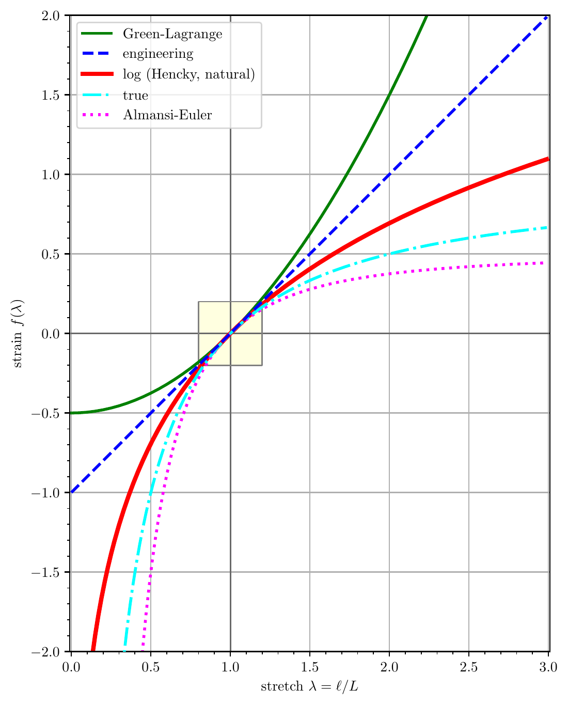
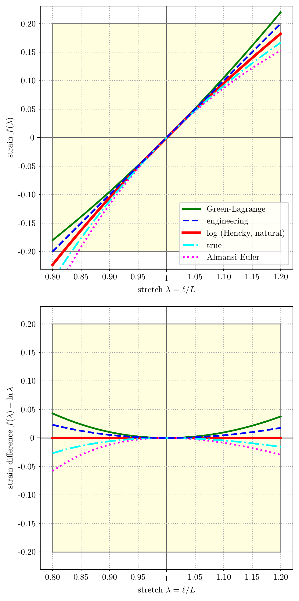
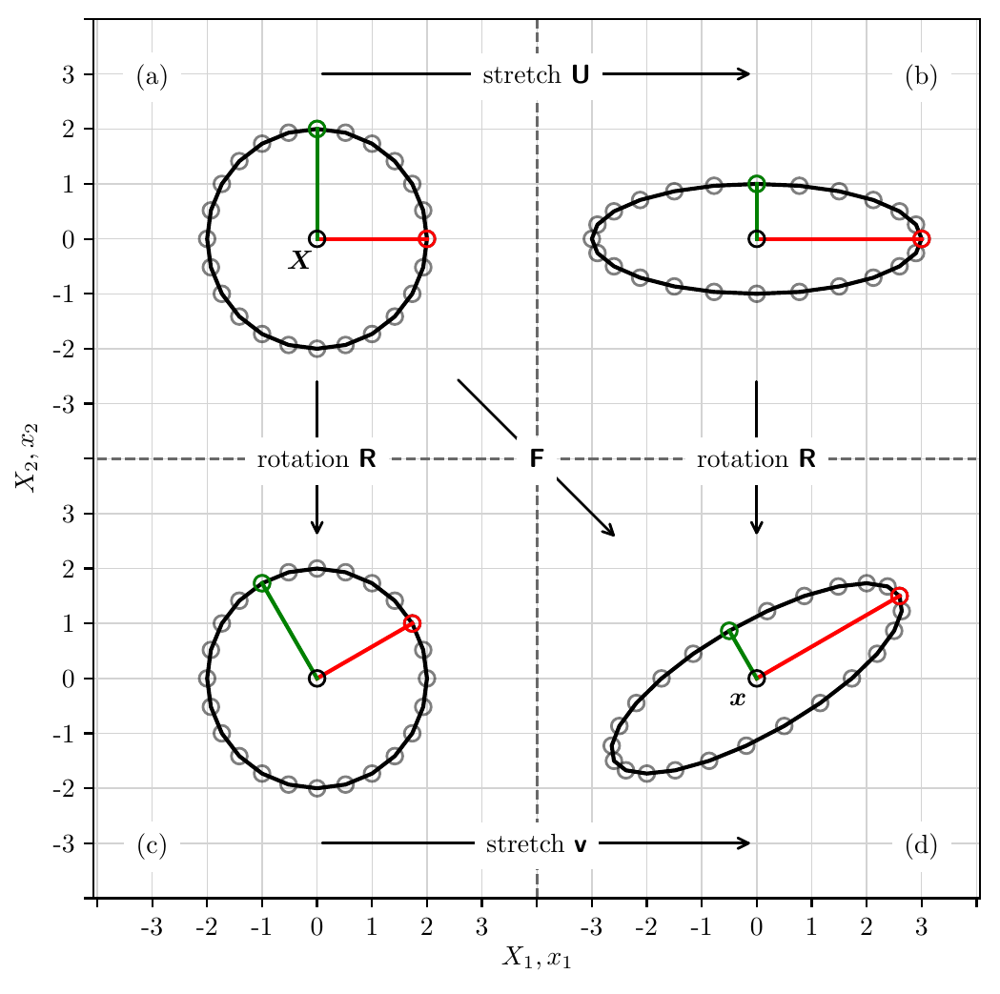

# Continuum Mechanics

This section summarizes the kinematics of general (finite) motion,
the motion map, the deformation gradient and its
Jacobian, the family of finite-strain measures and their linearizations, and the
polar and spectral decompositions. **Lower
case indices** ($i, j, k$) denote components in the *current* configuration and
**upper case indices** ($I, J, K$) denote components in the *reference*
configuration.

## Motion

Let the arbitrary time interval be defined as $\mathbb{T} := [t_0, t_f]$, from
initial to final time, inclusive.[^t0] Let the **motion**, a one-parameter
family of configurations, $\boldsymbol{\varphi} : \mathbb{B} \times \mathbb{T}
\mapsto \mathbb{R}^3$, map the material particle $\boldsymbol{X}$ (the reference
configuration) into the current configuration $\boldsymbol{x}$,

$$
\boldsymbol{x} = \boldsymbol{\varphi}(\boldsymbol{X}, t) = \boldsymbol{\varphi}_t(\boldsymbol{X}).
$$

A motion $\boldsymbol{\varphi}$ evaluated at a particular time $t \in \mathbb{T}$
is referred to as a **current configuration** or **placement**. For any
placement at time $t$, there is a **displacement** field $\boldsymbol{u} :
\mathbb{B} \times \mathbb{T} \mapsto \mathbb{R}^3$,

$$
\boldsymbol{u}(\boldsymbol{X}, t) := \boldsymbol{\varphi}(\boldsymbol{X}, t) - \boldsymbol{X}
\quad\Longleftrightarrow\quad
u_i := \varphi_i - \delta_{iJ} X_J.
$$

Thus, the current configuration $\boldsymbol{\varphi}$ is simply a function of
the original placement $\boldsymbol{X}$, plus a displacement $\boldsymbol{u}$, which is a
function of placement $\boldsymbol{X}$ and time $t$,

$$
\boldsymbol{\varphi}(\boldsymbol{X}, t) = \boldsymbol{X} + \boldsymbol{u}(\boldsymbol{X}, t)
\quad\Longleftrightarrow\quad
\varphi_i = \delta_{iJ} X_J + u_i.
$$

The initial condition $\boldsymbol{u}_0$ is found from the initial placement
$\boldsymbol{\varphi}_0$ and the reference configuration $\boldsymbol{X}$,

$$
\boldsymbol{u}_0(\boldsymbol{X}) = \boldsymbol{u}(\boldsymbol{X}, 0) = \boldsymbol{\varphi}(\boldsymbol{X}, 0) - \boldsymbol{X}.
$$

## Deformation Gradient

To each configuration $\boldsymbol{\varphi}$, we define a **deformation
gradient** $\boldsymbol{F} : \mathbb{B} \times \mathbb{T} \mapsto \mathbb{M}^3_+$,

$$
\boldsymbol{F} := \mathrm{Grad}\,\boldsymbol{\varphi}(\boldsymbol{X}, t)
\quad\Longleftrightarrow\quad
F_{iJ} := \frac{\partial \varphi_i}{\partial X_J}.
$$

Real, square matrices of dimension three with positive determinant are denoted
$\mathbb{M}^3_+$. Gradient operations with and without a subscript "$0$" are
gradients taken in the reference and current configurations, respectively:

$$
\begin{aligned}
\mathrm{Grad}(\bullet) &= \frac{\partial(\bullet)}{\partial X_J} \quad\text{(reference configuration gradient)}, \\
\mathrm{grad}(\cdot) &= \frac{\partial(\cdot)}{\partial x_j} \quad\text{(current configuration gradient)}.
\end{aligned}
$$

Alternative notations are $\mathrm{GRAD}(\bullet)$ and $\mathrm{grad}(\cdot)$, respectively.

## Jacobian of the Deformation Gradient

The **Jacobian** of the deformation gradient,

$$
J := \det \boldsymbol{F},
$$

describes the (generally non-uniform) volumetric expansion or contraction of the
motion from the reference configuration $\boldsymbol{X}$. All configurations must be
admissible in the sense that the Jacobian of the deformation must be positive
($J > 0$). This requirement keeps the deformations from mapping the body to a
single, infinitesimally small point ($J = 0$) or turning the body inside-out
($J < 0$).

Isochoric motions preserve the body's total volume. A Jacobian of unity
($J = 1$) describes an isochoric motion. The table below describes the
categories of motions (expansion, volume-preserving, contraction, and
inadmissible) by Jacobian measure.

| $J < 0$ | $J = 0$ | $0 < J < 1$ | $J = 1$ | $J > 1$ |
|:---:|:---:|:---:|:---:|:---:|
| **inadmissible** | **inadmissible** | **contraction** | **isochoric** | **expansion** |
| body has turned inside-out | body has shrunk to zero volume | body's total volume has decreased | body's total volume is preserved | body's total volume has increased |

<figcaption>Table: Jacobian measure to categorize deformations.</figcaption>

Four important isochoric deformations are (1) pure translation, (2) pure
rotation, (3) isochoric stretch, and (4) isochoric shear.

## Displacement Gradient

From the displacement field defined above, the relationship between the
**displacement gradient** and the deformation gradient is given by

$$
\mathrm{Grad}\,\boldsymbol{u} = \mathrm{Grad}\,\boldsymbol{\varphi} - \boldsymbol{I} = \boldsymbol{F} - \boldsymbol{I}
\quad\Longleftrightarrow\quad
\frac{\partial u_i}{\partial X_J} = \frac{\partial \varphi_i}{\partial X_J} - \delta_{iJ}.
$$

## Right Cauchy-Green Deformation

The **right Cauchy-Green deformation** arises from the inner product of two
differential fiber elements in the reference configuration, $d\boldsymbol{X}_1$ and
$d\boldsymbol{X}_2$, mapped by the deformation gradient $\boldsymbol{F}$ to obtain the
inner product of the same differential fibers in the current configuration,
$d\boldsymbol{x}_1$ and $d\boldsymbol{x}_2$,

$$
d\boldsymbol{x}_1 \cdot d\boldsymbol{x}_2 = d\boldsymbol{x}_1^{\top} d\boldsymbol{x}_2 = (\boldsymbol{F}\, d\boldsymbol{X}_1)^{\top} \boldsymbol{F}\, d\boldsymbol{X}_2 = d\boldsymbol{X}_1^{\top}\, \boldsymbol{F}^{\top} \boldsymbol{F}\, d\boldsymbol{X}_2 = d\boldsymbol{X}_1^{\top}\, \boldsymbol{C}\, d\boldsymbol{X}_2,
$$

where

$$
\boldsymbol{C} := \boldsymbol{F}^{\top} \boldsymbol{F}
\quad\Longleftrightarrow\quad
C_{IJ} := F_{Ii}\, F_{iJ}.
$$

The right Cauchy-Green deformation tensor $\boldsymbol{C}$: (1) is defined in the
reference configuration, (2) is symmetric and positive-definite, (3) gets its
name from the location of the deformation gradient $\boldsymbol{F}$ in the
definition, which is to the right, (4) is a metric that maps fiber lengths from
the reference configuration to the current configuration, and (5) is
second-order in reference displacement gradients, as shown below:

$$
\begin{aligned}
\boldsymbol{C} = (\mathrm{Grad}\,\boldsymbol{\varphi})^{\top} \mathrm{Grad}\,\boldsymbol{\varphi}
    &= (\boldsymbol{I} + \mathrm{Grad}\,\boldsymbol{u})^{\top} (\boldsymbol{I} + \mathrm{Grad}\,\boldsymbol{u}), \\
    &= \boldsymbol{I} + \underset{\text{1st order}}{\underbrace{\mathrm{Grad}\,\boldsymbol{u} + (\mathrm{Grad}\,\boldsymbol{u})^{\top}}} + \underset{\text{2nd order}}{\underbrace{(\mathrm{Grad}\,\boldsymbol{u})^{\top} \mathrm{Grad}\,\boldsymbol{u}}}.
\end{aligned}
$$

This result can be expected since, by definition, $\boldsymbol{C}$ is second-order in
the deformation gradient $\mathrm{Grad}\,\boldsymbol{\varphi}$, and the
relationship between the deformation gradient
$\mathrm{Grad}\,\boldsymbol{\varphi}$ and the displacement gradient
$\mathrm{Grad}\,\boldsymbol{u}$ is linear.

## Left Cauchy-Green Deformation

The **left Cauchy-Green deformation** arises from similar multiplication as with
the right Cauchy-Green deformation, but with the stretching going in reverse,
from the current configuration back to the reference configuration,

$$
d\boldsymbol{X}_1 \cdot d\boldsymbol{X}_2 = d\boldsymbol{X}_1^{\top} d\boldsymbol{X}_2 = (\boldsymbol{F}^{-1} d\boldsymbol{x}_1)^{\top}\, \boldsymbol{F}^{-1}\, d\boldsymbol{x}_2 = d\boldsymbol{x}_1^{\top}\, \boldsymbol{F}^{-\top} \boldsymbol{F}^{-1}\, d\boldsymbol{x}_2 = d\boldsymbol{x}_1^{\top}\, \boldsymbol{b}^{-1}\, d\boldsymbol{x}_2,
$$

where

$$
\boldsymbol{b} := \boldsymbol{F} \boldsymbol{F}^{\top}
\quad\Longleftrightarrow\quad
b_{ij} := F_{iJ}\, F_{Jj}.
$$

The left Cauchy-Green deformation tensor $\boldsymbol{b}$: (1) is defined in the
current configuration, (2) is symmetric and positive-definite, (3) gets its name
from the location of the deformation gradient $\boldsymbol{F}$ in the definition,
which is to the left, (4) is a metric whose inverse maps fiber lengths from the
current configuration to the reference configuration, and (5) is second-order in
current displacement gradients.

## Green-Lagrange Strain

The Green-Lagrange strain tensor,

$$
\boldsymbol{E} := \tfrac{1}{2}(\boldsymbol{C} - \boldsymbol{I})
\quad\Longleftrightarrow\quad
E_{IJ} := \tfrac{1}{2}(C_{IJ} - \delta_{IJ}),
$$

is closely related to the right Cauchy-Green deformation tensor and is often used
in defining constitutive law relationships because the measure, when linearized
about the reference configuration, coincides with the small strain tensor of
linear deformation elasticity, denoted $\boldsymbol{\epsilon}$ and defined in the
[Infinitesimal Strain](#infinitesimal-strain) section. This relationship can be
seen as follows:

$$
\begin{aligned}
2\boldsymbol{E} &= \boldsymbol{I} + \mathrm{Grad}\,\boldsymbol{u} + (\mathrm{Grad}\,\boldsymbol{u})^{\top} + (\mathrm{Grad}\,\boldsymbol{u})^{\top} \mathrm{Grad}\,\boldsymbol{u} - \boldsymbol{I}, \\
2\boldsymbol{E}_{\text{LIN}} &= \mathrm{Grad}\,\boldsymbol{u} + (\mathrm{Grad}\,\boldsymbol{u})^{\top},
\end{aligned}
$$

where the higher-order (quadratic) term in the first line is set to zero to
achieve the linearized second line.

## Euler-Almansi Strain

The Euler-Almansi strain tensor,

$$
\boldsymbol{e} := \tfrac{1}{2}(\boldsymbol{I} - \boldsymbol{b}^{-1})
\quad\Longleftrightarrow\quad
e_{ij} := \tfrac{1}{2}\left(\delta_{ij} - (b_{ij})^{-1}\right),
$$

can likewise be used to approximate the small strain tensor
$\boldsymbol{\epsilon}$ by combining the definitions of the left Cauchy-Green
deformation and the deformation gradient as follows:

$$
\begin{aligned}
2\boldsymbol{e} &= \boldsymbol{I} - \left[ \mathrm{Grad}\,\boldsymbol{\varphi} (\mathrm{Grad}\,\boldsymbol{\varphi})^{\top} \right]^{-1} \\
    &= \delta_{ij} - \left[ \frac{\partial \varphi_i}{\partial X_J} \frac{\partial \varphi_j}{\partial X_J} \right]^{-1} = \delta_{ij} - \left[ \frac{\partial X_J}{\partial \varphi_i} \frac{\partial X_J}{\partial \varphi_j} \right] \\
    &= \boldsymbol{I} - \left[ (\boldsymbol{I} - \mathrm{grad}\,\boldsymbol{u})(\boldsymbol{I} - \mathrm{grad}\,\boldsymbol{u})^{\top} \right] \\
    &= \mathrm{grad}\,\boldsymbol{u} + \mathrm{grad}\,\boldsymbol{u}^{\top} - \mathrm{grad}\,\boldsymbol{u}\, \mathrm{grad}\,\boldsymbol{u}^{\top}, \\
2\boldsymbol{e}_{\text{LIN}} &= \mathrm{grad}\,\boldsymbol{u} + (\mathrm{grad}\,\boldsymbol{u})^{\top},
\end{aligned}
$$

where the higher-order (quadratic) term is set to zero to achieve the linearized
final line.

## Small Strain

When displacement gradients are small in the reference configuration,

$$
\mathrm{Grad}\,\boldsymbol{u} \ll 1,
$$

or in the current configuration,

$$
\mathrm{grad}\,\boldsymbol{u} \ll 1,
$$

respectively, the nonlinear gradient terms are negligible and the finite strain
theory simplifies to small strain theory, which occurs when finite strain
measures are linearized to obtain $\boldsymbol{E}_{\text{LIN}}$ and
$\boldsymbol{e}_{\text{LIN}}$ in the previous sections.

Note that we have restricted the *gradients* of displacement, and not the
displacement $\boldsymbol{u}$ itself. Thus, displacements between the reference and
current configurations can be large (finite), but the gradients of the
displacement, either in the reference or current configuration, are small.

The [Strain Tensors and Finite Rotations](#strain-tensors-and-finite-rotations)
section will demonstrate that the small strain tensors are not suitable to
describe motion that contains finite rotation. This makes sense because, in
finite rotation, gradients of displacement are large, not small. To adequately
describe motion that includes finite rotation, a fully nonlinear strain measure,
such as the [Seth-Hill strain family](#seth-hill-strain-family), must be used.

## Infinitesimal Strain

If we further restrict the small strain theory such that the displacement is
small compared to unity,

$$
\boldsymbol{u} \ll 1,
$$

the infinitesimal strain theory is obtained, which has no distinction between
Lagrangian and Eulerian strain tensors.

In this case, the two small strain tensors, $\boldsymbol{E}_{\text{LIN}}$ and
$\boldsymbol{e}_{\text{LIN}}$, converge to a single definition of strain, called the
infinitesimal strain tensor $\boldsymbol{\epsilon}$, defined as

$$
\boldsymbol{\epsilon} := \tfrac{1}{2}\left(\mathrm{grad}\,\boldsymbol{u} + (\mathrm{grad}\,\boldsymbol{u})^{\top}\right).
$$

Note that the $\mathrm{Grad}(\bullet)$ notation has been dropped since the
distinction between the reference and current configurations is nonexistent.
Also, note that the factor of $\tfrac{1}{2}$ appears because it then follows that
the infinitesimal strain is simply the symmetric part of the displacement
gradient,

$$
\boldsymbol{\epsilon} = \operatorname{sym}(\mathrm{grad}\,\boldsymbol{u}).
$$

Finally, note that the finite Lagrangian and Eulerian strain tensors were defined
with the factor of $\tfrac{1}{2}$ so that their expressions, once linearized and
subject to a small displacement assumption, simplify to exactly the
infinitesimal strain tensor $\boldsymbol{\epsilon}$.

## Seth-Hill Strain Family

We now return to finite strain definitions. Seth and Hill showed that the
Green-Lagrange strain tensor $\boldsymbol{E}$ and the Euler-Almansi strain tensor
$\boldsymbol{e}$ are special cases of the so-called Seth-Hill family of strain
measures, defined as

$$
\boldsymbol{E}^{(m)} := \begin{cases} \dfrac{1}{m}\left(\boldsymbol{U}^m - \boldsymbol{I}\right) & \text{for } m \neq 0, \\[2ex] \ln\boldsymbol{U} & \text{for } m = 0; \text{ and,} \end{cases}
$$

$$
\boldsymbol{e}^{(m)} := \begin{cases} \dfrac{1}{m}\left(\boldsymbol{I} - \boldsymbol{v}^{-m}\right) & \text{for } m \neq 0, \\[2ex] \ln\boldsymbol{v} & \text{for } m = 0. \end{cases}
$$

The principal stretches $\lambda_{\alpha} = l_{\alpha}/L_{\alpha}$,
$0 < \lambda_{\alpha} < \infty$, allow the strain measure $\boldsymbol{E}^{(m)}$ to be
written as principal strains, as a function of principal stretch,
$f(\lambda_{\alpha})$,

$$
\begin{aligned}
\boldsymbol{E}^{(m)} &= \sum_{\alpha=1}^3 f(\lambda_{\alpha})\, \boldsymbol{N}_{\alpha} \otimes \boldsymbol{N}_{\alpha}
\quad\Longleftrightarrow\quad
\\
E^{(m)}_{IJ} &= f(\lambda_1) \begin{bmatrix} 1 & 0 & 0 \\ 0 & 0 & 0 \\ 0 & 0 & 0 \end{bmatrix} + f(\lambda_2) \begin{bmatrix} 0 & 0 & 0 \\ 0 & 1 & 0 \\ 0 & 0 & 0 \end{bmatrix} + f(\lambda_3) \begin{bmatrix} 0 & 0 & 0 \\ 0 & 0 & 0 \\ 0 & 0 & 1 \end{bmatrix},
\end{aligned}
$$

where the **stretch function**

$$
f(\lambda_{\alpha}) := \begin{cases} \dfrac{1}{m}\left(\lambda^m_{\alpha} - 1\right) & \text{for } m \neq 0, \\[2ex] \ln \lambda_{\alpha} & \text{for } m = 0. \end{cases}
$$

For integer values[^integer_m] of $m \in [-2, 2]$, five common strain measures
result, listed in the table below, in their three-dimensional and
one-dimensional forms. Similar relationships can be constructed for the spatial
tensors using

$$
\boldsymbol{e}^{(m)} = \sum_{\alpha=1}^3 g(\lambda_{\alpha})\, \boldsymbol{n}_{\alpha} \otimes \boldsymbol{n}_{\alpha},
\qquad
g(\lambda_{\alpha}) := \begin{cases} \dfrac{1}{m}\left(1 - \lambda^{-m}_{\alpha}\right) & \text{for } m \neq 0, \\[2ex] \ln \lambda_{\alpha} & \text{for } m = 0. \end{cases}
$$

| $m$ | Name | 3D | 1D |
|:---:|:---|:---|:---|
| $2$ | Green-Lagrange | $\boldsymbol{E}^{(2)} = \tfrac{1}{2}\left(\boldsymbol{U}^2 - \boldsymbol{I}\right)$ | $E_{\text{\tiny LAG}} = \tfrac{1}{2}\left[\left(\tfrac{\ell}{L}\right)^2 - 1\right]$ |
| $1$ | engineering (Biot, nominal) | $\boldsymbol{E}^{(1)} = \boldsymbol{U} - \boldsymbol{I}$ | $E_{\text{ENG}} = \dfrac{\ell - L}{L}$ |
| $0$ | log (Hencky, natural) | $\boldsymbol{E}^{(0)} = \ln\boldsymbol{U}$ | $E_{\text{LOG}} = \ln\left(\dfrac{\ell}{L}\right)$ |
| $-1$ | true | $\boldsymbol{E}^{(-1)} = \boldsymbol{I} - \boldsymbol{U}^{-1}$ | $E_{\text{TRUE}} = \dfrac{\ell - L}{\ell}$ |
| $-2$ | Euler-Almansi | $\boldsymbol{E}^{(-2)} = \tfrac{1}{2}\left(\boldsymbol{I} - \boldsymbol{U}^{-2}\right)$ | $E_{\text{EUL}} = \tfrac{1}{2}\left[1 - \left(\dfrac{L}{\ell}\right)^2\right]$ |

<figcaption>Table: Strains obtained from the Seth-Hill family.</figcaption>

The one-dimensional strains are illustrated as a function of stretch ratio
$\lambda = \ell/L$ in the figure below.

<figure class="figure-box">
    
    <figcaption>
        Figure: One-dimensional strain as a function of stretch ratio. Source: <code>stretch_strain.py</code>.
    </figcaption>
</figure>

The figure illustrates several results:

* For small stretches, $\ell \approx L$, (a) the stretch ratio is near unity,
  $\lambda \approx 1$, (b) the strain values are small, $f(\lambda) \approx 0$,
  and (c) the tangent of the strains with respect to the stretch ratio is near
  unity, $df/d\lambda \approx 1$.
* For elongations, $\lambda > 1$, the strain monotonically increases since
  $df/d\lambda > 0$ when $\lambda > 0$.
* For extreme compressions, $\lambda \approx 0$, (a) the Green-Lagrange strain
  goes to a value of $-\tfrac{1}{2}$, (b) the engineering (Biot, nominal) strain
  tensor goes to a value of $-1$, and (c) the log, true, and Eulerian strains
  tend to $-\infty$.
* The engineering (Biot, nominal) strain is a linear function of stretch
  $\lambda$; all other measures are nonlinear functions of stretch $\lambda$.

Neff (2013)[^neff] suggested "reasonable requirements" on $f(\lambda) :
\mathbb{R}^+ \mapsto \mathbb{R}$, summarized in the table below, wherein a "+"
indicates the requirement is satisfied and a "−" indicates the requirement is not
satisfied.

| Requirement | $\boldsymbol{E}^{(2)}$ | $\boldsymbol{E}^{(1)}$ | $\boldsymbol{E}^{(0)}$ | $\boldsymbol{E}^{(-1)}$ | $\boldsymbol{E}^{(-2)}$ |
|:---|:---:|:---:|:---:|:---:|:---:|
| $f$ is smooth | + | + | + | + | + |
| $f$ is monotonically increasing | + | + | + | + | + |
| $\left. f \right\rvert_{\lambda = 1} = 0$ | + | + | + | + | + |
| $\left. f' \right\rvert_{\lambda = 1} = 1$ | + | + | + | + | + |
| as $\lambda \to \infty$, $f \to +\infty$ | + | + | + | − | − |
| as $\lambda \to 0^+$, $f \to -\infty$ | − | − | + | + | + |
| $-f(\lambda) = f\!\left(\tfrac{1}{\lambda}\right)$ | − | − | + | − | − |
| $f(\lambda^{\alpha}) = \alpha f(\lambda)$ for $\alpha \in \mathbb{R}$ | − | − | + | − | − |

<figcaption>Table: Reasonable requirements on the stretch function.</figcaption>

The results above illustrate that the log strain $\boldsymbol{E}^{(0)}$ retains more
of the desired qualities than any other strain tensor, in the context of finite
compression and extension.[^bazant]

For infinitesimal deformation, all tensors converge to the infinitesimal strain
tensor $\boldsymbol{\epsilon} = \operatorname{sym}(\mathrm{grad}\,\boldsymbol{u})$.
For finite deformation, however, the Seth-Hill strain measures given by the
$f(\lambda)$ function diverge quickly for both large compression and large
tension. The figure below illustrates the one-dimensional strains subtracted from
the natural logarithmic strain, $\ln \lambda$, as a function of stretch ratio
$\lambda = \ell/L$. The log strain is considered as the finite deformation
baseline. The results show, for example, that in compression at $\lambda = 0.8$,
the Green-Lagrange strain tensor underreports the log strain by nearly 5%. Such a
result illustrates that for finite deformation, (1) strain measures are **not**
interchangeable, and (2) it is incomplete to simply say "strain." Rather, both
the strain value *and* strain tensor must be specified.

<figure class="figure-box">
    
    <figcaption>
        Figure: One-dimensional strain difference of the strain function minus the natural logarithmic strain as a function of stretch ratio. Source: <code>stretch_strain.py</code>.
    </figcaption>
</figure>

## Strain Tensors and Finite Rotations

Because it takes on nonzero values under finite rotation, the linearized strain
tensor should not be used for geometrically nonlinear analysis. These nonzero
values are completely artificial and strictly an artifact of using a linear
strain definition with geometrically nonlinear motions. This result is shown as
follows.

Let $\boldsymbol{R} = \boldsymbol{R}(t)$ be a two-dimensional, rigid body rotation
parameterized by time $t$ and scaled by constant $\omega = 2\pi$ radians per
second. Then, the motion $\boldsymbol{\varphi}$ of a body can be written as

$$
\boldsymbol{\varphi}(\boldsymbol{X}, t) = \boldsymbol{R}(t)\, \boldsymbol{X}
\quad\Longleftrightarrow\quad
\begin{Bmatrix} x_1 \\ x_2 \end{Bmatrix} = \begin{bmatrix} \cos\omega t & \sin\omega t \\ -\sin\omega t & \cos\omega t \end{bmatrix} \begin{Bmatrix} X_1 \\ X_2 \end{Bmatrix}.
$$

Then the deformation gradient $\boldsymbol{F} = \boldsymbol{F}(t)$ is a function of time
alone,

$$
\boldsymbol{F}(t) \quad\Longleftrightarrow\quad F_{iJ} = \begin{bmatrix} F_{11} & F_{12} \\ F_{21} & F_{22} \end{bmatrix} = \begin{bmatrix} \cos\omega t & \sin\omega t \\ -\sin\omega t & \cos\omega t \end{bmatrix}.
$$

The linearized strain tensor is found to be

$$
\begin{aligned}
2\boldsymbol{E}_{\text{LIN}} &= \mathrm{Grad}\,\boldsymbol{u} + (\mathrm{Grad}\,\boldsymbol{u})^{\top}, \\
&= \boldsymbol{F} - \boldsymbol{I} + \left(\boldsymbol{F} - \boldsymbol{I}\right)^{\top}, \\
&= F_{iJ} - \delta_{iJ} + F_{Ji} - \delta_{Ji}, \\
&= \begin{bmatrix} \cos\omega t & \sin\omega t \\ -\sin\omega t & \cos\omega t \end{bmatrix} + \begin{bmatrix} \cos\omega t & -\sin\omega t \\ \sin\omega t & \cos\omega t \end{bmatrix} - \begin{bmatrix} 2 & 0 \\ 0 & 2 \end{bmatrix}, \\
&= 2\left(\cos\omega t - 1\right) \boldsymbol{I}.
\end{aligned}
$$

Now, for small angles, $\omega t \approx 0$, which is for small deviations
$x_1 \approx X_1$, $x_2 \approx X_2$, then $\boldsymbol{E}_{\text{LIN}} = \boldsymbol{0}$
for rigid body rotations. However, for arbitrary finite angles, $\omega t \neq
0$, and the linearized strain tensor $\boldsymbol{E}_{\text{LIN}}$ reports nonzero
strain for rigid body rotations, which is nonsensical.

A correct strain tensor will report zero strain for rigid body rotations. One
such strain tensor is the fully nonlinear Green-Lagrange strain tensor. This
result is shown as follows:

$$
\begin{aligned}
2\boldsymbol{E} &= \boldsymbol{F}^{\top}\boldsymbol{F} - \boldsymbol{I} \\
&= \begin{bmatrix} \cos\omega t & -\sin\omega t \\ \sin\omega t & \cos\omega t \end{bmatrix} \begin{bmatrix} \cos\omega t & \sin\omega t \\ -\sin\omega t & \cos\omega t \end{bmatrix} - \begin{bmatrix} 1 & 0 \\ 0 & 1 \end{bmatrix} = \boldsymbol{0}.
\end{aligned}
$$

## Polar Decomposition

Given the **rotation tensor** $\boldsymbol{R}$, the **material stretch tensor**
$\boldsymbol{U}$, and the **spatial stretch tensor** $\boldsymbol{v}$, the deformation
gradient $\boldsymbol{F}$ has the multiplicative decomposition,

$$
\boldsymbol{F} = \boldsymbol{R}\, \boldsymbol{U} = \boldsymbol{v}\, \boldsymbol{R}
\quad\Longleftrightarrow\quad
F_{iJ} = R_{iK}\, U_{KJ} = v_{ik}\, R_{kJ}.
$$

Here we have a slight abuse of notation, where intermediate configurations that
have stretched but not yet rotated are denoted with capital letter indices. Thus
the "$K$" subscript in $R_{iK} U_{KJ}$ is an intermediate stretched but
non-rotated configuration.

The stretch tensors $\boldsymbol{U}$ and $\boldsymbol{v}$ are both symmetric and positive
definite. The rotation tensor $\boldsymbol{R}$ is non-symmetric and orthogonal. The
figure below shows the polar decomposition about a material point $\boldsymbol{X}$
and fibers $d\boldsymbol{X}$ in its vicinity mapped to the spatial point $\boldsymbol{x}$
with the same fibers mapped to $d\boldsymbol{x}$.

<figure class="figure-box">
    
    <figcaption>
        Figure: In the vicinity of $\boldsymbol{X}$, mapped to $\boldsymbol{x} = \boldsymbol{\varphi}(\boldsymbol{X})$, the polar decomposition of deformation gradient $\boldsymbol{F}$ into stretch $\boldsymbol{U}$ then rotation $\boldsymbol{R}$; or, into rotation $\boldsymbol{R}$ then stretch $\boldsymbol{v}$: (a) reference configuration, (b) stretched configuration, (c) rotated configuration, (d) current configuration. As shown, the eigenvalues of $\boldsymbol{U}$ (and $\boldsymbol{v}$) are $\lambda_1 = 1.5$, $\lambda_2 = 0.5$, $\lambda_3 = 1$ and the rotation $\boldsymbol{R}$ has a magnitude of $30^\circ$ about the $\boldsymbol{e}_3$ axis. Source: <code>polar_decomposition.py</code>.
    </figcaption>
</figure>

## Principal Stretches and Axes

The stretch tensors $\boldsymbol{U}$ and $\boldsymbol{v}$ have the same eigenvalues,
$(\lambda_1, \lambda_2, \lambda_3)$, called **principal stretches**. For
non-trivial rotations, i.e. $\boldsymbol{R} \neq \boldsymbol{I}$, $\boldsymbol{U}$ and
$\boldsymbol{v}$ have unique eigenvectors, called **principal stretch directions**.
The principal stretch directions of $\boldsymbol{U}$ are $\left\{\boldsymbol{N}_1,
\boldsymbol{N}_2, \boldsymbol{N}_3\right\}$. The principal stretch directions of
$\boldsymbol{v}$ are $\left\{\boldsymbol{n}_1, \boldsymbol{n}_2, \boldsymbol{n}_3\right\}$. The
two sets of eigenvectors are related through rotation $\boldsymbol{R}$,

$$
\boldsymbol{n}_1 = \boldsymbol{R}\, \boldsymbol{N}_1, \qquad
\boldsymbol{n}_2 = \boldsymbol{R}\, \boldsymbol{N}_2, \qquad
\boldsymbol{n}_3 = \boldsymbol{R}\, \boldsymbol{N}_3;
$$

or generally,

$$
\boldsymbol{n}_{\alpha} = \boldsymbol{R}\, \boldsymbol{N}_{\alpha} \quad \text{for } \alpha = 1, 2, 3.
$$

## Spectral Representation

The deformation gradient, its polar decomposition, and the Cauchy-Green
deformations have spectral decompositions in terms of the principal stretches and
stretch directions,

$$
\begin{aligned}
\boldsymbol{F} &= \sum_{\alpha=1}^3 \lambda_{\alpha}\, \boldsymbol{n}_{\alpha} \otimes \boldsymbol{N}_{\alpha}, & \boldsymbol{U} &= \sum_{\alpha=1}^3 \lambda_{\alpha}\, \boldsymbol{N}_{\alpha} \otimes \boldsymbol{N}_{\alpha}, \\
\boldsymbol{R} &= \sum_{\alpha=1}^3 \boldsymbol{n}_{\alpha} \otimes \boldsymbol{N}_{\alpha}, & \boldsymbol{v} &= \sum_{\alpha=1}^3 \lambda_{\alpha}\, \boldsymbol{n}_{\alpha} \otimes \boldsymbol{n}_{\alpha}, \\
\boldsymbol{C} &= \sum_{\alpha=1}^3 \lambda^2_{\alpha}\, \boldsymbol{N}_{\alpha} \otimes \boldsymbol{N}_{\alpha}, & \boldsymbol{b} &= \sum_{\alpha=1}^3 \lambda^2_{\alpha}\, \boldsymbol{n}_{\alpha} \otimes \boldsymbol{n}_{\alpha}.
\end{aligned}
$$

The Green-Lagrange strain tensor $\boldsymbol{E}$ and the Euler-Almansi strain tensor
$\boldsymbol{e}$, in principal stretches and stretch directions, are

$$
\boldsymbol{E} = \sum_{\alpha=1}^3 \tfrac{1}{2}\left(\lambda^2_{\alpha} - 1\right) \boldsymbol{N}_{\alpha} \otimes \boldsymbol{N}_{\alpha}, \qquad
\boldsymbol{e} = \sum_{\alpha=1}^3 \tfrac{1}{2}\left(1 - \lambda^{-2}_{\alpha}\right) \boldsymbol{n}_{\alpha} \otimes \boldsymbol{n}_{\alpha}.
$$

The generalization of the Seth-Hill material strain tensor $\boldsymbol{E}^{(m)}$ and
spatial strain tensor $\boldsymbol{e}^{(m)}$, in principal stretches and stretch
directions, are

$$
\boldsymbol{E}^{(m)} = \sum_{\alpha=1}^3 \frac{1}{m}\left(\lambda^m_{\alpha} - 1\right) \boldsymbol{N}_{\alpha} \otimes \boldsymbol{N}_{\alpha}, \qquad
\boldsymbol{e}^{(m)} = \sum_{\alpha=1}^3 \frac{1}{m}\left(1 - \lambda^{-m}_{\alpha}\right) \boldsymbol{n}_{\alpha} \otimes \boldsymbol{n}_{\alpha},
$$

and the relationship between the two strain tensors is given through a rotation
$\boldsymbol{R}$ transformation,

$$
\boldsymbol{e}^{(-m)} = \boldsymbol{R}\, \boldsymbol{E}^{(m)}\, \boldsymbol{R}^{\top}.
$$

In the case when $m \to \infty$, the material and spatial **logarithmic strain
tensors**, also known as the **Hencky** material and spatial strain tensors,
$\boldsymbol{H}$ and $\boldsymbol{h}$, are obtained as[^xiao]

$$
\begin{aligned}
\boldsymbol{H} = \ln \boldsymbol{U} = \boldsymbol{E}^{(0)} &= \sum_{\alpha=1}^3 \ln \lambda_{\alpha}\, \boldsymbol{N}_{\alpha} \otimes \boldsymbol{N}_{\alpha}, \text{ and} \\
\boldsymbol{h} = \ln \boldsymbol{v} = \boldsymbol{e}^{(0)} &= \sum_{\alpha=1}^3 \ln \lambda_{\alpha}\, \boldsymbol{n}_{\alpha} \otimes \boldsymbol{n}_{\alpha}.
\end{aligned}
$$

Two concrete illustrations follow: [Rigid Body Motion](./rigid_body_motion.md)
works through pure translation as the simplest possible deformation, and
[Simple Shear](./simple_shear.md) works through an isochoric shear in closed
form, computing $\boldsymbol{F}$, $\boldsymbol{C}$, $\boldsymbol{E}$, $\boldsymbol{b}$, and
$\boldsymbol{e}$ explicitly.

[^t0]: Note that $t_0$, while typically zero, may be any real number less than $t_f$.

[^integer_m]: Technically, $m$ can be any real number, not just an integer.

[^neff]: Neff, P. (2013). *The Hencky strain measure is the geodesic distance to SO($n$)*, at 6.

[^bazant]: The Bažant strain, $f(\lambda) = \tfrac{1}{2}\left(\lambda - \tfrac{1}{\lambda}\right)$, not considered here, also satisfies $-f(\lambda) = f\!\left(\tfrac{1}{\lambda}\right)$.

[^xiao]: See Xiao H, Bruhns OT, Meyers A. *Hypo-elasticity model based upon the logarithmic stress rate*. Journal of Elasticity. 1997 Apr 1;47(1):51-68, at page 54, Eq. (2.2).
