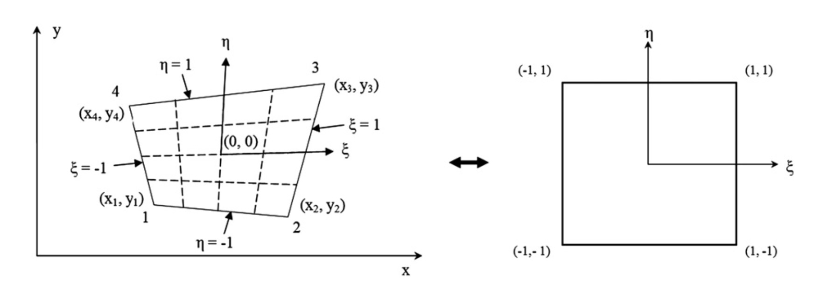

# Finite Element Method

A finite element mesh is a collection of **nodes** (points) connected into
**elements** — small regions used to interpolate a quantity of interest
(e.g. displacement) across the whole domain. The point grid built in
[Multi-Point Motion](./multi_point_motion.md#point-grid) is exactly the
kind of nodal point collection a mesh needs, and [Tracking the
Grid](./multi_point_motion.md#tracking-the-grid) already found every one
of its 12 points' current positions — exactly the per-node displacement
data a mesh needs to represent how an object deformed.

[Tracking the Grid](./multi_point_motion.md#tracking-the-grid) already
covers the kernel-size-versus-point-spacing tradeoff involved in getting
that per-node data reliably — the same considerations apply whether the
points come from a toy grid or a real mesh.

Once every node's current position is known, an actual finite element
mesh still needs one more thing this page doesn't provide: **element
connectivity** — which nodes join together into which elements. Building
that connectivity is future work, not implemented here; the element
formulation connectivity would plug into — shape functions, strain, and
deformation gradient, for the four-node quadrilateral element — is what
this page covers below.

## Four-Noded Quadrilateral Finite Element (Q4)

The four-node quadrilateral element is one of the most commonly used elements in 2D FEA. It has four corner nodes, with each node having two degrees of freedom (DOFs): displacements in the $X$ and $Y$ directions.

<figure class="figure-box">
    
    <figcaption>
        Figure:  Illustration of isoparameteric mapping between (left) an arbitrary quadrilateral element in global (physical) coordinates to (right) the local (natural) coordinates.  The local domain is sometimes called the parent quadrilateral element.  
    </figcaption>
</figure>

Image credit: James *et al.*[^James_2012]

**Note:** Since we are using a *finite deformation* [continuum mechanics](./continuum_mechanics.md) framework,
we will use $X$ and $Y$ (instead of $x$ and $y$ in the James *et al.* figure above).

### Shape Functions

For the element in local coordinates $(\xi, \eta) \in [−1, 1] \times [−1,1]$, the bilinear shape functions are defined:

$$
\begin{align}
N_1(\xi, \eta) &:= \frac{1}{4}(1-\xi)(1-\eta) \\
N_2(\xi, \eta) &:= \frac{1}{4}(1+\xi)(1-\eta) \\
N_3(\xi, \eta) &:= \frac{1}{4}(1+\xi)(1+\eta) \\
N_4(\xi, \eta) &:= \frac{1}{4}(1-\xi)(1+\eta)
\end{align}
$$

The shape functions satisfy the following properties:

* Kronecker delta property: $N_a(\xi_b,\eta_b) = \delta_{ab}$ (equals 1 at node $a$, 0 at other nodes)
* Partition of unity: $\sum_{a=1}^4 N_a (\xi , \eta) = 1$ for all $(\xi, \eta)$

### Local Coordinates

The key concept in finite element analysis is the **isoparametric mapping** between the local coordinate system and the global coordinate system.

This mapping allows:
- Integration to be performed on the local domain (parent element)
- Handling of arbitrarily shaped quadrilaterals
- Use of the same shape functions for geometry and displacement (isoparametric concept)

The isoparametric coordinates $(\xi, \eta)$ range from $-1$ to $+1$ in both the $X$ and $Y$ directions. 

The mapping between global coordinates $(X, Y)$ and local coordinates is introduced as a linear combination of local shape functions $N_{\rm node}(\boldsymbol{X})$:

$$
\boldsymbol{X}(\boldsymbol{\xi}) = 
\begin{Bmatrix}
x(\xi, \eta) \\
y(\xi, \eta)
\end{Bmatrix}
= \sum_{a=1}^{4} N_a(\boldsymbol{\xi}) \boldsymbol{X}_a
= \sum_{a=1}^{4} N_a(\xi, \eta)
\begin{Bmatrix}
X_a \\
Y_a
\end{Bmatrix}
$$

where $(X_a, Y_a)$ is the position of node $a$, and $a = 1 \ldots 4$.

### Shape Function Derivatives in Local Coordinates

The derivatives with respect to the local coordinate system are

$$
\frac{\partial N_a(\xi, \eta)}{\partial \xi} = \frac{1}{4}
\begin{bmatrix}
-(1-\eta) \\
(1-\eta) \\
(1+\eta) \\
-(1+\eta)
\end{bmatrix}, \quad
\frac{\partial N_a(\xi, \eta)}{\partial \eta} = \frac{1}{4}
\begin{bmatrix}
-(1-\xi) \\
-(1+\xi) \\
(1+\xi) \\
(1-\xi)
\end{bmatrix}
$$

These are assembled into a $2 \times 4$ matrix:

$$
\frac{\partial \boldsymbol{N}(\boldsymbol{\xi})}{\partial \boldsymbol{\xi}} =
\begin{bmatrix}
\frac{\partial N_1}{\partial \xi} & \frac{\partial N_2}{\partial \xi} & \frac{\partial N_3}{\partial \xi} & \frac{\partial N_4}{\partial \xi} \\[1em]
\frac{\partial N_1}{\partial \eta} & \frac{\partial N_2}{\partial \eta} & \frac{\partial N_3}{\partial \eta} & \frac{\partial N_4}{\partial \eta}
\end{bmatrix}_{2 \times 4}
$$

### Jacobian Matrix

The Jacobian matrix $\boldsymbol{j}_0$ relates derivatives in local coordinates to derivatives in global coordinates.  It is important to include the "matrix" part of "Jacobian matrix".  It is distinct from the [Jacobian of the Deformation Gradient](./continuum_mechanics.md#jacobian-of-the-deformation-gradient) $J$, which is a scalar value (*not* a matrix).  For nodal coordinates organized as:

$$
\boldsymbol{X} = 
\begin{bmatrix}
X_1 & Y_1 \\
X_2 & Y_2 \\
X_3 & Y_3 \\
X_4 & Y_4
\end{bmatrix}_{4 \times 2}
$$

the Jacobian matrix $\boldsymbol{j}_0$ is computed as:

$$
\boldsymbol{j}_0(\boldsymbol{\xi}) := \frac{\partial \boldsymbol{X}(\boldsymbol{\xi})}{\partial \boldsymbol{\xi}} 
= \begin{bmatrix}
\frac{\partial X}{\partial \xi} & \frac{\partial Y}{\partial \xi} \\[1em]
\frac{\partial X}{\partial \eta} & \frac{\partial Y}{\partial \eta}
\end{bmatrix}_{2 \times 2}
= \frac{\partial \boldsymbol{N}(\boldsymbol \xi)}{\partial \boldsymbol{\xi}} \cdot \boldsymbol{X} 
$$ 

The individual components (droping the $\bullet_0$ reference configuration notation to avoid subscript confusion) are:

$$
\begin{align}
j_{11} &= \frac{\partial X}{\partial \xi} = \sum_{a=1}^{4} \frac{\partial N_a}{\partial \xi} X_a \\[1em]
j_{12} &= \frac{\partial Y}{\partial \xi} = \sum_{a=1}^{4} \frac{\partial N_a}{\partial \xi} Y_a \\[1em]
j_{21} &= \frac{\partial X}{\partial \eta} = \sum_{a=1}^{4} \frac{\partial N_a}{\partial \eta} X_a \\[1em]
j_{22} &= \frac{\partial Y}{\partial \eta} = \sum_{a=1}^{4} \frac{\partial N_a}{\partial \eta} Y_a
\end{align}
$$

### Shape Function Derivatives in Global Coordinates

The transformation from local to global coordinate derivatives requires the inverse Jacobian matrix through the chain rule.
Since

$$
\frac{\partial N_a}{\partial X} = 
\frac{\partial N_a}{\partial \xi} \frac{\partial \xi}{\partial X}
+
\frac{\partial N_a}{\partial \eta} \frac{\partial \eta}{\partial X}
$$

$$
\frac{\partial N_a}{\partial Y} = 
\frac{\partial N_a}{\partial \xi} \frac{\partial \xi}{\partial Y}
+
\frac{\partial N_a}{\partial \eta} \frac{\partial \eta}{\partial Y}
$$

then

$$
\begin{bmatrix}
\frac{\partial N_a}{\partial X} \\[1em]
\frac{\partial N_a}{\partial Y}
\end{bmatrix}
=
\begin{bmatrix}
\frac{\partial \xi}{\partial X} & \frac{\partial \eta}{\partial X} \\[1em]
\frac{\partial \xi}{\partial Y} & \frac{\partial \eta}{\partial Y}
\end{bmatrix}_{2 \times 2}
\begin{bmatrix}
\frac{\partial N_a}{\partial \xi} \\[1em]
\frac{\partial N_a}{\partial \eta}
\end{bmatrix}
= \boldsymbol{j}_0^{-1}(\boldsymbol{X})
\begin{bmatrix}
\frac{\partial N_a}{\partial \xi} \\[1em]
\frac{\partial N_a}{\partial \eta}
\end{bmatrix}
$$

In matrix form for all shape functions:

$$
\frac{\partial \boldsymbol{N}}{\partial \boldsymbol{X}} = \boldsymbol{j}_0^{-1} \cdot \frac{\partial \boldsymbol{N}}{\partial \boldsymbol{\xi}}
$$

where:

$$
\frac{\partial \boldsymbol{N}}{\partial \boldsymbol{X}} = 
\begin{bmatrix}
\frac{\partial N_1}{\partial X} & \frac{\partial N_2}{\partial X} & \frac{\partial N_3}{\partial X} & \frac{\partial N_4}{\partial X} \\[0.5em]
\frac{\partial N_1}{\partial Y} & \frac{\partial N_2}{\partial Y} & \frac{\partial N_3}{\partial Y} & \frac{\partial N_4}{\partial Y}
\end{bmatrix}_{2 \times 4}
$$

### Displacement Field

The displacement $\boldsymbol{u}(\boldsymbol{X})$ is defined as the difference between the current configuration $\boldsymbol{\varphi}(\boldsymbol{X})$ and the reference configuration $\boldsymbol{X}$,

$$
\boldsymbol{u}(\boldsymbol{X}) :=
\boldsymbol{\varphi}(\boldsymbol{X}) - \boldsymbol{X}
$$

The displacement field within the element is interpolated using shape functions:

$$
\boldsymbol{u}(\xi, \eta) = 
\begin{Bmatrix}
u(\xi, \eta) \\
v(\xi, \eta)
\end{Bmatrix}
= \sum_{a=1}^{4} N_a(\boldsymbol{\xi}) \boldsymbol{u}_a
= \sum_{a=1}^{4} N_a(\xi, \eta)
\begin{Bmatrix}
u_a \\
v_a
\end{Bmatrix}
$$

where $(u_a, v_a)$ is the respective $(X, Y)$ displacement of node $a$, and $a = 1 \ldots 4$.

### Displacement Gradient

$$\boldsymbol{\nabla}_0\,\boldsymbol{u}(\boldsymbol{X}) =
\begin{bmatrix}
\frac{\partial u}{\partial X} & \frac{\partial u}{\partial Y} \\[1em]
\frac{\partial v}{\partial X} & \frac{\partial v}{\partial Y}
\end{bmatrix}_{2 \times 2}
$$

Each component is computed using the chain rule:

$$
\begin{align}
\frac{\partial u}{\partial X} &= \sum_{a=1}^{4} \frac{\partial N_a}{\partial X} u_a \\[1em]
\frac{\partial u}{\partial Y} &= \sum_{a=1}^{4} \frac{\partial N_a}{\partial Y} u_a \\[1em]
\frac{\partial v}{\partial X} &= \sum_{a=1}^{4} \frac{\partial N_a}{\partial X} v_a \\[1em]
\frac{\partial v}{\partial Y} &= \sum_{a=1}^{4} \frac{\partial N_a}{\partial Y} v_a
\end{align}
$$

In compact matrix notation:

$$\boldsymbol{\nabla}_0\,\boldsymbol{u} = \left( \frac{\partial \boldsymbol{N}}{\partial \boldsymbol{X}} \cdot \boldsymbol{u} \right)^T
$$

where $\boldsymbol{u}$ is the nodal displacement matrix:

$$
\boldsymbol{u} = 
\begin{bmatrix}
u_1 & v_1 \\
u_2 & v_2 \\
u_3 & v_3 \\
u_4 & v_4
\end{bmatrix}_{4 \times 2}
$$

See [Displacement Gradient](./continuum_mechanics.md#displacement-gradient) for more information.

### Deformation Gradient

The deformation gradient tensor $\boldsymbol{F}(\boldsymbol{X})$ maps material points in the reference configuration $\boldsymbol{X}$ to their positions in the current (deformed) configuration $\boldsymbol{\varphi}$:

$$
\boldsymbol{F}(\boldsymbol{X}) := \frac{\partial \boldsymbol{\varphi}(\boldsymbol{X})}{\partial \boldsymbol{X}}
$$

Because $\boldsymbol{u}(\boldsymbol{X})= \boldsymbol{\varphi}(\boldsymbol{X}) - \boldsymbol{X}$, 

$$
\boldsymbol{\nabla}_0\,\boldsymbol{u} = \boldsymbol{F} - \boldsymbol{I} \quad \implies \quad 
\boldsymbol{F} =
\boldsymbol{\nabla}_0\,\boldsymbol{u} + \boldsymbol{I}
$$

Explicitly:

$$
\boldsymbol{F}
= 
\begin{bmatrix}
F_{11} & F_{12} \\[0.5em]
F_{21} & F_{22}
\end{bmatrix}
=
\begin{bmatrix}
\frac{\partial u}{\partial X} + 1 & \frac{\partial u}{\partial Y} \\[0.5em]
\frac{\partial v}{\partial X} & \frac{\partial v}{\partial Y} + 1
\end{bmatrix}
$$

The determinant $J:=\det(\boldsymbol{F})$
represents the local volume ratio and must be positive for physically admissible deformations.
See [Deformation Gradient](./continuum_mechanics.md#deformation-gradient) and [Jacobian of the Deformation Gradient](./continuum_mechanics.md#deformation-gradient) for more information.

### Gauss Points

To evaluate quantities that depend on the displacement field and its gradient, such as strain, we use **Gaussian Quadrature**.  We don't typically calculate quantities 
at the nodes.  Rather, we quantities strain at specific *integration points* (also known as **Gauss points**) where mathematical precision is the highest.

For a 2D quadrilateral element, we typically use a $2 \times 2$ Gauss rule.  The integration points are located in the local coordinate system $(\xi, \eta)$ at

$$
\xi, \eta \in \left\{\pm \frac{1}{\sqrt{3}} \right\} \approx \pm 0.57735
$$

## References

[^James_2012]: James KA, Lee E, Martins JR. Stress-based topology optimization using an isoparametric level set method. Finite Elements in Analysis and Design. 2012 Oct 1;58:20-30. [link](https://doi.org/10.1016/j.finel.2012.03.012)
