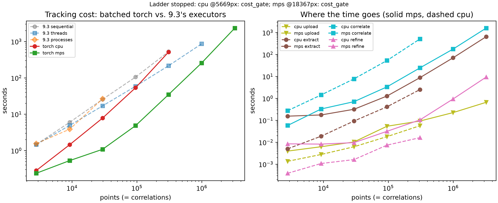

# Parallelism with PyTorch

[Timing at Scale](./timing_at_scale.md) found a wall. Tracking a million
points took 14.4 minutes on ten cores. A billion correlations, the scale
[Path Forward](./path_forward.md) names as the real target, extrapolates
to roughly 1.4 weeks on the same machine. No amount of additional
CPU-side tuning closes a gap that size.

That page also found *why*. Every point ran its own separate correlation
call, and each call carried its own Python-level overhead: a function
call, a pair of array slices, an FFT plan, an object constructed for the
result. At a few hundred points that overhead disappears into the noise.
At a million points it *is* the cost.

This page changes the shape of the work rather than the amount. Instead of a million small correlations, it runs a small number of very
large ones. Thousands of points get correlated in a single call. No Python
loop runs between them. It reruns [Timing at Scale](./timing_at_scale.md)'s
own ladder that way, on the same machine and at the same geometry. The
two sets of numbers then sit side by side.

## Test Machine

Every number here depends on the hardware that produced it. Same machine
[Timing at Scale](./timing_at_scale.md) used:

* **Apple MacBook Pro (14-inch, 2021), model `MacBookPro18,3`, Apple M1
Pro chip, 10 CPU cores (8 Performance + 2 Efficiency), 32GB unified
memory, macOS 26.6.2.**

The M1 Pro also carries an integrated GPU, which every prior page in this
book has left completely unused.

## Where This Came From

This page continues work that started elsewhere, and the credit belongs
where it started.

Andrew Polonsky and Chad Hovey investigated exactly this question in
2025, in a separate private codebase. The direction came out of a
discussion Polonsky had with a colleague at the Naval Research
Laboratory, written up in an email dated 2025-04-15:

> Really thought pytorch may be the likely way to go for us, which
> already optimizes stuff for GPU [...] Depending on our subset size, we
> are right on the cusp of whether or not doing the FFT for
> cross-correlation will be faster than brute force sliding dot product.

Three conclusions from that discussion shaped everything after it.
Numba works well for CPU work but is the wrong tool for a GPU. Writing
raw GPU code portably is painful enough that the NRL colleague resorted
to hand-written OpenCL. And PyTorch already solves the portability
problem, because it runs the same code on a CUDA card, on an Apple GPU,
or on a plain CPU.

A team meeting on 2025-09-23 recorded the decision in one line: *"torch
implementation, then CUDA implementation."*

The implementation that followed established the batching trick this
page's next section describes, and measured it on a Windows machine with
an NVIDIA card. Those measurements used a 35x35 pixel kernel inside a
120x120 pixel search window:

| Correlations | PyTorch GPU | PyTorch CPU | NumPy CPU |
|---|---|---|---|
| 1,000 | 0.044 s | 0.836 s | 1.47 s |
| 50,000 | 3.09 s | 40.8 s | 73.6 s |

Two things stand out in that table. The GPU beat NumPy by 24x at 50,000
correlations. And the correlation itself stopped being the expensive
part: building the tensors took 16.3 seconds and checking the answers
took 12.1 seconds, against 3.09 seconds of actual computation. That
finding shows up again on this page, at a different scale, on different
hardware.

That earlier work also left three gaps. It never implemented an FFT
version, despite the email above naming one. It never refined a peak to
subpixel accuracy. And it never ran on macOS at all — the correlation
module opened with a hard refusal:

```python
if platform.system() != "Darwin":
    import torch
else:
    raise RuntimeError("This module requires PyTorch, which does not run on macOS.")
```

That claim is false. PyTorch runs on macOS, and has supported Apple GPUs
since 2022. A sibling file in the same codebase already contained
working Apple GPU device selection. The two files were never reconciled,
so the module that actually did the correlation stayed locked out of the
machine its author used every day.

This page closes two of those three gaps: it runs on Apple silicon, and
it refines to subpixel. The FFT version stays open.

## Kernels, Search Windows, and Names

Two vocabularies collide here, so it is worth settling them once.

This book has used *kernel* and *search area* since [Cross
Correlation](./cross_correlation.md). Commercial DIC software, and the
earlier work above, use different words for the same two things:

| This book | VIC-2D and the earlier work | What it is |
|---|---|---|
| kernel | subset | The small patch cut from the reference image, the thing being located |
| search area | area of interest, or *aoi* | The larger region of the current image to look inside |

They are the same two arrays. A *subset* is a kernel. An *aoi* is a
search area. The code below uses this book's names; the tensor shapes
quoted from the earlier work use its own.

## One Call, N Correlations

Here is the trick.

`conv2d` slides a small array over a larger one and reports how well
they match at every position. That is one correlation. To get N
correlations, the naive approach calls it N times in a Python loop, which
reintroduces exactly the per-call overhead this page exists to remove.

The way out is to stack the work so a single call does all of it.
`conv2d` accepts a *batch* of images with multiple *channels*, and a set
of filters. By default it applies every filter to every channel, which
would compute an N x N cross product — every kernel against every search
area. That is both wrong and N times too much work.

The `groups` argument fixes it. Setting `groups=N` splits N input
channels into N independent groups of one. Kernel `i` then sees search
area `i`, and nothing else:

```python
# search areas: (1, N, S, S)   N search areas, stacked as CHANNELS
# kernels:      (N, 1, K, K)   N kernels, one per group
# output:       (1, N, S-K+1, S-K+1)
surfaces = F.conv2d(search_areas, kernels, groups=N)
```

Read the shapes carefully, because they are not the obvious ones. The
batch dimension holds a single element. The *channel* dimension carries
the N correlations. That deliberate misuse of the two dimensions is what
lets one call do N independent correlations.

At this book's own geometry, tracking 2,809 points in a 300 pixel image,
the shapes come out as `(1, 2809, 48, 48)` for the search areas,
`(2809, 1, 26, 26)` for the kernels, and `(1, 2809, 23, 23)` for the
output. Every one of those 2,809 correlations happens inside a single
`conv2d` call.

One convenient accident makes this work without any correction.
Mathematical convolution flips the kernel before sliding it; correlation
does not. Despite its name, `conv2d` does not flip. It already computes
cross-correlation, which is exactly what tracking a point needs.

## What `conv2d` Actually Computes

The shapes above say what goes in and what comes out. They say nothing
about how, and the how turns out to matter for reading this page's
results.

`F.conv2d` is not one algorithm. It is a dispatch. PyTorch hands the problem to a vendor library: oneDNN on a CPU, cuDNN on
an NVIDIA card, MPSGraph on an Apple GPU. That library then picks an
implementation based on the shapes it was given. The usual pick lowers the convolution
into a matrix multiply, an approach called implicit GEMM, so it lands on
decades of tuned linear-algebra work.

That is a **sliding dot product**, restructured. It is not an FFT.

cuDNN does carry FFT-based algorithms and can select them, but typically
for kernels much larger than the 26x26 one this page uses. So in
practice, on the shapes here, the answer is: brute force, executed
extremely well.

Which lands this page on a specific side of the tradeoff that email
named. A direct sliding correlation costs roughly $O(n k^2)$, where $n$
counts search-area pixels and $k$ the kernel's side. An FFT-based one
costs roughly $O(n \log n)$. The earlier work's own estimate put the FFT
about 300 times ahead for a 35² kernel in a 120² window.

So every CPU measurement in [Subpixel Accuracy](./subpixel_accuracy.md),
[High Point Density](./high_point_density.md) and [Timing at
Scale](./timing_at_scale.md) came from the FFT side of that cusp. Every
measurement on this page comes from the brute-force side. Comparing them
changes two things at once: the execution engine, and the algorithm.
Keep that in view when reading the table below. A speedup here is not
purely a GPU result.

One more detail worth naming. Setting `groups=N` over N channels makes
this a *depthwise* convolution — the same pattern that appears in
mobile-optimized neural networks. Vendor libraries treat depthwise
convolution as a special case with its own dedicated routines, separate
from the ones dense convolution uses. Whether that helps or hurts at
these shapes is a measurable question, not an assumable one.

## Choosing a Device

PyTorch runs the same code on three kinds of hardware. Picking one is a
short ladder, best to worst:

```python
if torch.cuda.is_available():
    device, sync = torch.device("cuda"), torch.cuda.synchronize
elif torch.backends.mps.is_available():
    device, sync = torch.device("mps"), torch.mps.synchronize
else:
    device, sync = torch.device("cpu"), lambda: None
```

**MPS** stands for **Metal Performance Shaders**. It is Apple's framework
for offloading matrix operations and tensor math onto the GPU built into
Apple silicon — the M1, M2, M3 and M4 families. It is native, and it
requires an Apple silicon Mac. It is fast for two reasons: the GPU runs
enormous numbers of operations in parallel, and Apple's unified memory
gives it very high bandwidth to work against.

Unified memory has a second consequence worth stating before any number
gets compared across machines. On this laptop, the CPU and the GPU share
one physical pool of memory. Moving an array to the GPU does not copy it across a bus. On a discrete
NVIDIA card it does, because host and device hold genuinely separate
memory. So transfer costs on this machine are not the transfer costs on
that one. A speedup measured here does not carry over to a CUDA result.

Two practical constraints follow from the device choice.

**Apple GPUs do not support float64.** Every tensor downcasts to float32.
This book's images are 8-bit to begin with, so the input loses nothing.
The correlation arithmetic does run at lower precision than the CPU path
uses. Whether that costs accuracy is measured below rather than assumed.

**GPU work is queued, not immediate.** A call returns as soon as the work
is submitted, long before it finishes. Timing it without a `sync()` call
measures how fast the queue accepts work — a number that looks
spectacular and means nothing. Every timing on this page brackets its own
synchronize call.

One thing this page's benchmark deliberately does *not* do: fall back to
the CPU when a requested device is missing. The earlier work fell back
with a printed warning, which is how a CPU measurement ends up labeled as
a GPU one. A missing device here stops the run and says so.

## Batching Against Device Memory

Stacking N search areas into one tensor raises a question [Timing at
Scale](./timing_at_scale.md) never had to ask. How much memory does that tensor take?

One search area holds $S^2$ float32 values. At the 300 pixel image size,
$S = 48$, so that is 48 x 48 x 4 bytes, about 9 KB. Small. But
[Timing at Scale](./timing_at_scale.md#finding-the-ceiling) grows the
search area along with the image, because a 2% stretch displaces a far
edge further in a bigger picture. By the 10204 pixel size, $S = 420$, and
one search area costs 420 x 420 x 4 bytes, about 706 KB.

Multiply by point count and the totals stop being comfortable:

<!-- cmdrun python3 -c "import timing_at_scale_bench as b; td = lambda v: f'<td style=\"text-align: right;\">{v}</td>'; print('<table>'); print('<thead><tr><th>Width (px)</th><th>Points</th><th>Search area</th><th>All search areas at once</th><th>Both images, resident</th></tr></thead>'); print('<tbody>'); [print('<tr>' + td(w) + td(f'{c*c:,}') + td(f'{2*s}x{2*s}') + td(f'{c*c*(2*s)**2*4/1e9:,.1f} GB') + td(f'{2*w*w*4/1e9:.2f} GB') + '</tr>') for w in b._widths() for o, c, s in [b.grid_params(w)]]; print('</tbody>'); print('</table>')" -->

This machine has 32 GB, and Apple's Metal layer will admit only about
26.8 GB of it as a working set. So materializing every search area at
once stops being possible somewhere between the 1750 pixel and 5669 pixel
sizes.

The fix is to process points in **chunks**. Take a few thousand points,
build their tensors, correlate them, keep the answers, free the tensors,
move on. Chunk size becomes this page's own new variable, the way
`max_workers` was [Parallelization](./parallelization.md)'s. A larger
chunk spreads each call's fixed cost over more correlations. A smaller
chunk keeps the batch inside memory. The benchmark below sizes each chunk
to fit a stated 4 GB budget and reports what it chose.

Chunking also exposes something wasteful. At 5 pixel point spacing and a
250 pixel search area, two neighboring points' search areas overlap
almost completely. Materializing both copies nearly every pixel twice,
and across a whole grid the same pixels get copied hundreds of times
over. The correlation needs those copies laid out contiguously, so the
waste buys something real. But it explains why the extraction step
below costs what it does.

That waste is also the reason the last column above matters separately
from the fourth. **Search areas are chunkable; the two full images are
not.** Both images stay resident for an entire size, because every chunk
cuts its windows out of them. Chunking can shrink everything except
those two arrays — which is exactly what makes this page's stopping rule
work, below.

## Subpixel from a Correlation Surface

`conv2d` returns the whole correlation surface, not just its peak. That
surface is more informative than the single best-matching integer
position, and it makes subpixel accuracy nearly free.

The true peak almost never lands exactly on a sample. Fitting a parabola
through the best sample and its two neighbors recovers where it actually
sits:

$$
\delta = \frac{1}{2}\cdot\frac{C_{-1} - C_{+1}}{C_{-1} - 2C_0 + C_{+1}}
$$

applied independently along each axis. It costs one gather of each peak's
immediate neighborhood, then arithmetic. It batches exactly the way the
correlation does.

This closes one of the three gaps the earlier work left open. That
implementation stopped at the integer peak and never refined it.

Parabolic fitting carries a known bias called **peak locking**: it pulls
estimates slightly toward whole-pixel positions. Rather than assert how
large that bias is, this page measures it. Every point's true destination
is known exactly — a point at $x$ lands at $1.02x$ — so both the error
and the bias can be checked directly against truth. Those results appear
in the next section.

## Checking the Answer Before Timing It

A fast wrong answer is worthless. Before any timing on this page, the
batched correlation gets checked two ways at the 300 pixel size, on every
device.

**Does it find the same integer positions
[`dictk.grid.locate`](../api/dictk/grid.html#locate) finds?** Not quite,
and the gap is instructive. It agrees on 2,772 of 2,809 points, 98.7%.
Every one of the 37 disagreements is off by exactly one pixel in $x$ and
zero in $y$.

Those 37 are not errors. Checking where they fall: every disagreeing
point has a true destination whose fractional part lies between 0.460 and
0.560, averaging 0.503. They sit on the half-pixel boundary, where
rounding to a whole number is genuinely ambiguous. Phase correlation and
a sliding dot product break that tie differently. Measured against true
positions rather than against each other, the batched result is
marginally *closer*: 0.2598 pixels of mean absolute error against
`locate`'s 0.2606.

**How close does the refined position land?** Mean absolute error against
analytical truth, at the same 2,809 points:

| Method | Mean absolute error |
|---|---|
| `grid.locate_subpixel`, `upsample_factor=100` | 0.0925 px |
| Batched `conv2d`, parabolic refinement | 0.0369 px |

The parabolic fit is 2.5 times more accurate than the upsampled-DFT
refinement [Subpixel Accuracy](./subpixel_accuracy.md) introduced, and it
costs a small fraction of the correlation it rides on. That result was
not expected. It is worth stating plainly that these are two different
refinement mechanisms measured against the same truth, not a bug in
either.

Peak locking does show up, mildly. Binning the refined positions'
fractional parts into ten bins gives 330, 338, 258, 219, 280, 265, 210,
257, 313, 339 — against 280 per bin if the spread were flat. The bias
pulls toward whole pixels, by roughly 20% excess in the outer bins. It is
real, it is visible, and it is small enough that the method still beats
the alternative above by a wide margin.

The Apple GPU produces results identical to the CPU, digit for digit, at
every one of those 2,809 points. float32 costs nothing measurable here.

## The Same Ladder, on PyTorch

Same image sizes, same point grids, same kernel, same search areas,
same machine. The only change is what runs the correlation.
[Timing at Scale](./timing_at_scale.md)'s own threaded column sits
alongside, because it was that page's fastest CPU result:

<!-- cmdrun python3 -c "import csv; rows=list(csv.DictReader(open('parallelism_pytorch_bench.csv'))); old=list(csv.DictReader(open('timing_at_scale_bench.csv'))); g=lambda w,d,s: next((float(r['seconds']) for r in rows if int(r['width'])==w and r['device']==d and r['stage']==s), None); o=lambda w,s: next((float(r['seconds']) for r in old if int(r['width'])==w and r['stage']==s), None); pts={int(r['width']):int(r['points']) for r in rows if r['points']!='0'}; widths=sorted(pts); f=lambda v: '—' if v is None else (f'{v:.1f}s' if v<1000 else f'{v/60:.0f} min'); td=lambda v: f'<td style=\"text-align: right;\">{v}</td>'; print('<table>'); print('<thead><tr><th>Width (px)</th><th>Points</th><th>Search area</th><th>threads (9.3)</th><th>torch CPU</th><th>torch MPS</th><th>MPS speedup</th></tr></thead>'); print('<tbody>'); [print('<tr>'+td(w)+td(f'{pts[w]:,}')+td(f'{2*s}x{2*s}')+td(f(o(w,'threads')))+td(f(g(w,'cpu','total')))+td(f(g(w,'mps','total')))+td(f'{o(w,\"threads\")/g(w,\"mps\",\"total\"):.1f}x' if (o(w,'threads') and g(w,'mps','total')) else '—')+'</tr>') for w in widths for _o,_c,s in [__import__('timing_at_scale_bench').grid_params(w)]]; print('</tbody>'); print('</table>')" -->

<figure>
    
    <figcaption>Left: batched PyTorch against <a href="./timing_at_scale.html">Timing at Scale</a>'s own three executors, same geometry, same machine. Right: where each size's time actually goes, split into uploading the images, extracting search areas, correlating them, and refining the peaks.</figcaption>
</figure>

The Apple GPU wins at every size, but not by a constant factor. The way
that factor moves is the most interesting thing in the table.

It climbs first. 6.2x at 2,809 points, 9.3x at 9,216, peaking at 15.7x
at 29,584 points. That is batching paying off exactly as expected: more
correlations per call, the same fixed cost spread thinner.

Then it falls. 12.1x, then 6.2x, then 3.4x at 996,004 points. Point
count kept growing the whole time, so batching cannot explain the
decline. The search area explains it.

## The Cusp, Measured

Look at the `torch CPU` column against the `threads` column beside it.
Both run on the same ten cores. They differ only in algorithm.

At 29,584 points, with a 74x74 search area, torch CPU takes 7.8 seconds
against 16.9. The sliding dot product wins, better than two to one.

At 95,481 points, with a 102x102 search area, they are 53.4 against
58.6. A tie.

At 308,025 points, with a 156x156 search area, torch CPU takes 512.7
seconds against 215.2. The FFT wins, better than two to one, in the
other direction.

That crossover is the thing Polonsky's 2025 email predicted without
being able to locate:

> Depending on our subset size, we are right on the cusp of whether or
> not doing the FFT for cross-correlation will be faster than brute force
> sliding dot product.

On this machine, at this book's 26x26 kernel, the cusp sits near a
100x100 pixel search area. Below it, brute force wins. Above it, the FFT
wins. The complexity argument in *What `conv2d` Actually Computes*
predicts exactly this shape: direct correlation costs $O(n k^2)$ and
grows with the search area, while an FFT costs $O(n \log n)$ and barely
notices.

This also explains the Apple GPU's shrinking lead. The GPU is running
the losing algorithm. Its hardware advantage is large enough to stay
ahead anyway, but it is spending that advantage fighting an algorithm
that scales worse. At 996,004 points it is still 3.4x faster than ten
CPU cores, while doing asymptotically more work to get there.

Which reframes what this page found. The result is not "the GPU is 3.4x
faster." It is that a GPU running the *wrong* algorithm still beats ten
CPU cores running the right one. Nobody has combined the two yet.

## Where the Time Goes

Splitting each size into its four stages answers the question hdic's own
measurements raised, where building tensors cost five times what the
correlation cost:

<!-- cmdrun python3 -c "import csv; rows=list(csv.DictReader(open('parallelism_pytorch_bench.csv'))); g=lambda w,d,s: next((float(r['seconds']) for r in rows if int(r['width'])==w and r['device']==d and r['stage']==s), None); pts={int(r['width']):int(r['points']) for r in rows if r['points']!='0'}; widths=[w for w in sorted(pts) if g(w,'mps','total')]; f=lambda v: '—' if v is None else f'{v:.2f}s'; pc=lambda v,t: '' if (v is None or not t) else f' ({100*v/t:.0f}%)'; td=lambda v: f'<td style=\"text-align: right;\">{v}</td>'; print('<table>'); print('<thead><tr><th>Width (px)</th><th>Points</th><th>upload</th><th>extract</th><th>correlate</th><th>refine</th></tr></thead>'); print('<tbody>'); [print('<tr>'+td(w)+td(f'{pts[w]:,}')+''.join(td(f(g(w,'mps',s))+pc(g(w,'mps',s), g(w,'mps','total'))) for s in ('upload','extract','correlate','refine'))+'</tr>') for w in widths]; print('</tbody>'); print('</table>')" -->

Extraction is not the bottleneck here, and that is worth stating clearly
because the earlier work found the opposite. Two differences explain it.
That implementation rebuilt its tensors from NumPy on every batch,
crossing the host boundary each time. This one uploads both images once
per size, then cuts every window straight out of device memory. That fix
came from catching this script doing the slow thing first, and measuring
the difference.

Refinement costs almost nothing, which was the hope. Getting subpixel
accuracy out of a surface `conv2d` already computed is close to free.

## Knowing When to Stop

[Timing at Scale](./timing_at_scale.md) stopped each run with a
1800-second wall clock. That was the right tool there, and it is the
wrong tool here.

macOS does not raise a catchable error when a process exhausts host
memory. It swaps, or the kernel kills the process outright. There is no
exception to catch, so a clock was the only reliable stop available.

A GPU is different. It raises a real, catchable Python exception when it
runs out of device memory. So this page retires the clock and stops on
two conditions instead, neither of which is an arbitrary time limit.

**First, a caught out-of-memory error.** This works because of the
asymmetry the memory section already named. Chunking can shrink every
per-point tensor, so chunking alone never runs out. The two full images
cannot be chunked — both stay resident for an entire size. That
unchunkable part is what eventually fails. Before each size, the
benchmark computes what those two images will need and compares it
against what the device will admit. Then it attempts the size anyway, and
catches whatever actually happens. A prediction earns its place only if
the measurement gets a chance to contradict it.

Finding the right exception took a deliberate test rather than an
assumption. Apple's Metal layer reports running out of memory in more
than one way, and only one of them uses the phrase "out of memory". An
allocation past the remaining budget raises `MPS backend out of memory`.
A single tensor past Metal's per-buffer ceiling raises `Invalid buffer
size: 3013.73 GiB` instead, which never says "memory" at all. Forcing
both conditions on purpose, at a small size, revealed the second one.
Trusting the first message to be the only one would have turned a real
memory finding into an unexplained crash.

**Second, a predicted-cost gate.** Compute grows faster than memory here,
so the ladder becomes impractical before it becomes impossible. Each size
predicts its own cost from the previous size's *measured* rate, counting
both point count and per-correlation size. A prediction past one hour
stops that device, and the prediction gets recorded along with the
measurement it came from.

That is not a new idea on this page.
[Timing at Scale](./timing_at_scale.md#where-it-breaks) already reasoned
this way twice: it stopped a run deliberately once its cause was
understood, and it extrapolated a measured rate out to 1.4 weeks rather
than spending 1.4 weeks confirming it. The change here is making that
reasoning the rule up front, instead of a judgment call afterward.

A wall-clock watchdog does still exist, set at four hours. Its only job
is to stop an unattended overnight run from hanging forever on a wedged
GPU driver. It sits far past anything the cost gate would allow. So if it ever
fires, that is a harness problem to investigate, not a finding about
scaling. There, the timeout *was* the finding. Here it must never be.

## Where It Breaks

Neither device ran out of memory. Not once, at any size.

That is worth stating bluntly, because this page was built expecting the
opposite. The stopping rules above put a caught out-of-memory error
first, and worked out in advance which size should trigger it. The
measurement contradicted the prediction. The cost gate fired first, on
both devices, and the memory wall was never reached.

The numbers are not close. At the largest size either device attempted,
the two resident images occupied 0.83 GB of Metal's 26.8 GB budget —
about 3%. Peak host memory across the entire run reached 13.9 GB of 32.
The prediction that images would eventually stop fitting is still
arithmetically correct, at a size around 59508 pixels. This ladder simply
never gets there, because the arithmetic to process such a size takes
longer than anyone would wait.

**`cpu` stopped at 5669 pixels.** Its own measured rate at 3149 pixels
predicted 4,890 seconds for the next size, past the one-hour budget. The
prediction was recorded rather than run.

**`mps` went two sizes further.** It completed 10204 pixels — 3,229,209
points in 2,334.7 seconds — then predicted 23,937 seconds for 18367
pixels and stopped.

That 10204 pixel size is the interesting one.
[Timing at Scale](./timing_at_scale.md#where-it-breaks) attempted exactly
it, with threads, and could not finish it. The Apple GPU completed it in
39 minutes.

### Throughput Rises, Then Falls

Points tracked per second, at each size `mps` completed:

<!-- cmdrun python3 -c "import csv; rows=list(csv.DictReader(open('parallelism_pytorch_bench.csv'))); g=lambda w,d,s: next((float(r['seconds']) for r in rows if int(r['width'])==w and r['device']==d and r['stage']==s), None); pts={int(r['width']):int(r['points']) for r in rows if r['points']!='0'}; td=lambda v: f'<td style=\"text-align: right;\">{v}</td>'; print('<table>'); print('<thead><tr><th>Width (px)</th><th>Search area</th><th>Points</th><th>Seconds</th><th>Points/second</th><th>1e9 points would take</th></tr></thead>'); print('<tbody>'); [print('<tr>'+td(w)+td(f'{2*s}x{2*s}')+td(f'{pts[w]:,}')+td(f'{t:,.1f}')+td(f'{pts[w]/t:,.0f}')+td(f'{1e9/(pts[w]/t)/3600:,.0f} h')+'</tr>') for w in sorted(pts) for t in [g(w,'mps','total')] if t for _o,_c,s in [__import__('timing_at_scale_bench').grid_params(w)]]; print('</tbody>'); print('</table>')" -->

Throughput climbs to 27,374 points per second at 29,584 points, then
falls away steadily. By the largest size it has dropped to 1,383, a
twentyfold decline.

Point count is not the cause. Point count only ever increased. The search area is the cause. The CPU comparison already showed why: a
sliding dot product's work grows with the area it slides over, and this
ladder grows that area at every rung.

Which makes the last column read as a warning rather than a forecast.
"How long would a billion correlations take" has no single answer here.
It is 10 hours at a 74x74 search area and 201 hours at a 420x420 one,
using the same hardware, the same code, and the same algorithm. Search
area, not point count, is what decides.

Against [Timing at Scale](./timing_at_scale.md)'s own closing
extrapolation, measured at the same 996,004-point size: threads managed
1,156 points per second, which is where that page's estimate of roughly
1.4 weeks for a billion came from. The Apple GPU manages 3,884 at the
same size. Same problem, same machine, about 3 days instead of 10.

That is a real improvement and it is not enough. A billion correlations
is [Path Forward](./path_forward.md)'s entry-level target, not its
ceiling. Three days of continuous computation for the smallest
interesting problem still rules out the tens of billions that page names
as realistic.

The encouraging part is where the remaining headroom sits. This page
spent its entire GPU advantage running the algorithm that
[the cusp measurement above](#the-cusp-measured) shows is the wrong one
at these search areas. Nothing here has yet combined the better hardware
with the better algorithm.

## CUDA, Pending

This page has no NVIDIA results.

The machine to run them on exists: a Windows workstation with a CUDA
card, the same one that produced the 2025 measurements quoted at the top
of this page. Access to it is pending, so the CUDA column below stays
empty rather than estimated.

The benchmark already supports it. `device_select` resolves `cuda` first
when a CUDA device is visible, and every timing already brackets the
correct per-device synchronize call. Running this page's ladder there
requires no code change — only the machine.

Two things are worth knowing in advance about how that comparison will
read. The unified memory point above means transfer costs will differ
structurally, not just in magnitude. And cuDNN chooses among more
convolution algorithms than Metal does, including FFT-based ones. So the
dispatch question in *What `conv2d` Actually Computes* may resolve
differently there.

## What Comes Next

The FFT gap is still open, and it is now the obvious next step.

Every correlation on this page is a sliding dot product. Every CPU correlation in [Subpixel Accuracy](./subpixel_accuracy.md),
[High Point Density](./high_point_density.md) and [Timing at
Scale](./timing_at_scale.md) is an FFT. Those are the two sides of the cusp Polonsky's 2025 email named. This book
has now measured each side on different hardware. That is exactly the
comparison that cannot settle the question.

A batched `torch.fft` phase correlation would settle it. It would run the
*same* algorithm the three pages above already use, on the *same* devices
this page already measures. That makes the comparison engine-for-engine,
instead of across two variables at once. It would also reuse this page's chunking,
its device selection, and its stopping rules unchanged.

That work is not started.

## `parallelism_pytorch_bench.py`

```python
<!-- cmdrun cat parallelism_pytorch_bench.py -->
```
