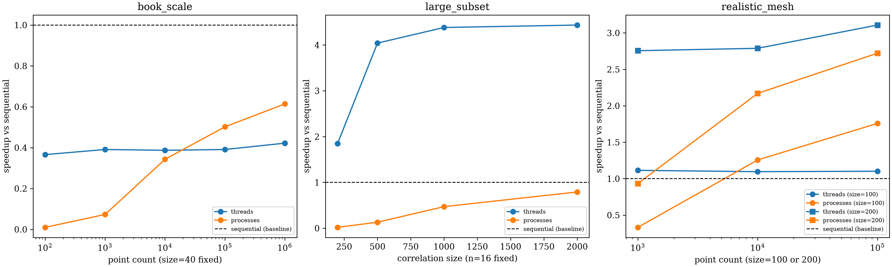

# Parallelization

[Multi-Point Motion](./multi_point_motion.md#tracking-the-grid) just ran 12
independent calls to
[`dictk.translation.locate`](../api/dictk/translation.html#locate) — one
per point, each doing its own FFT-based phase correlation — to verify
every point's displacement. We anticipate the need to process a very
large number of point-to-point correspondences to support large-scale
DIC work — a real finite element mesh (see [Finite Element
Method](./finite_element_method.md)) can easily have thousands-to-millions
of nodes, not the 12 points in the simple grid above. Each point
correspondence is independent of every other: locating point $i$ never
reads or writes anything locating point $j$ touches. That independence
isn't just a convenient property to point out —
[`dictk.grid.locate`](../api/dictk/grid.html#locate) is already written to
exploit it. Its entire body is a single map over `reference_points`, one
call to [`dictk.translation.locate`](../api/dictk/translation.html#locate)
per point, accumulating no shared state between iterations:

```python
return [
    translation.locate(
        reference_image=reference_image,
        current_image=current_image,
        reference_point=reference_point,
        search_center=search_center,
        kernel_margin_width=kernel_margin_width,
        kernel_margin_height=kernel_margin_height,
        search_margin_width=search_margin_width,
        search_margin_height=search_margin_height,
    )
    for reference_point, search_center in zip(reference_points, search_centers)
]
```

Because every iteration is already independent, parallelizing it is a
matter of swapping this list comprehension for a parallel map over the
same per-point calls. It is not a redesign.
[`dictk.grid.locate`](../api/dictk/grid.html#locate) does exactly that
today, behind two extra keyword-only parameters: `max_workers` and
`executor`. Default `max_workers=None` stays sequential, the loop above,
byte-identical to `locate`'s original behavior. A positive integer
switches to a worker pool instead.

Which pool, though, is not obvious. It needs its own explanation first.

## Threads, Processes, and the GIL

CPython has a **Global Interpreter Lock (GIL)**: only one thread can
execute Python bytecode at a time, even on a machine with many cores. A
plain Python `for` loop split across threads would not run any faster.
Each thread would still wait its turn for the same lock.

C extensions can release the GIL during their own C-level computation,
though. NumPy and SciPy both do this for many operations. The FFT
`dictk.translation.locate` actually runs is one of them —
`skimage.registration.phase_cross_correlation` calls `scipy.fft.fftn`
and `scipy.fft.ifftn` internally, not the Python-level fallback, and
`scipy.fft` releases the GIL for the duration of its own C computation.
So threads *can* run FFT correlations in true parallel. The GIL is not
held the whole time.

Whether that helps depends on scale. A tiny FFT finishes almost
instantly. Most of the wall-clock time around it is Python-level
overhead: function calls, object construction, array slicing. Releasing
the GIL for a few microseconds does not buy much when the thread
scheduling and GIL reacquisition around it cost microseconds too. A
large FFT is different. Once the C computation itself dominates the
call, the GIL-released fraction of wall-clock time dominates too, and
threads start to pay off.

## Threads vs. Processes: Two Different Costs

A `ThreadPoolExecutor` shares the caller's own memory. No pickling, no
process spawn. Cheap to start. But every task still pays a GIL
scheduling cost, and that cost does not shrink as task count grows. Run
one task or a million, each one pays it individually.

A `ProcessPoolExecutor` is different. Each worker is a separate OS
process, with its own interpreter and its own GIL. It gets true
parallelism regardless of whether the target function releases the GIL
at all. The cost moves elsewhere: data has to be pickled across the
process boundary, and on macOS (which spawns fresh interpreters rather
than forking) each worker re-imports NumPy, SciPy, and scikit-image
from scratch before it can do any work. That cost is mostly fixed and
paid once, when the pool starts.

That is the real asymmetry: **processes pay once, threads pay every
time.** More tasks amortize a process pool's fixed startup cost. More
tasks do not shrink a thread pool's per-task cost. Which one wins
depends on both how big each task is and how many tasks there are —
not on either alone.

## Measuring the Trade Space

Rather than guess, measure.
[`parallelization_bench.py`](#parallelization_benchpy) (full source
below) times sequential, threaded, and process-pool execution of
`phase_cross_correlation` across three scenarios. Correlation size and
point count are not independent in a real DIC problem — a
million-point mesh only makes sense with a small subset per point — so
this is three targeted scenarios, not one brute-force grid:

- **`book_scale`**: this book's own kernel/search size (40 pixels),
  point count climbing from 100 to 1,000,000. Does point count alone
  ever create a crossover, at a size this small?
- **`large_subset`**: only 16 points, correlation size climbing from
  200 to 2,000 pixels. Where does the threads crossover sit, as a
  function of size alone?
- **`realistic_mesh`**: a closer match to an actual finite element
  mesh — moderate correlation size (100 or 200 pixels), point count
  climbing from 1,000 to 100,000.

This sweep takes several minutes to run (the `book_scale` scenario's
1,000,000-point case alone runs over a minute) — far too slow to
re-run on every build the way this book's other figures do. Its results
are measured once and committed alongside the script that produced
them, not regenerated live. The table below still reads live from that
committed data, so it always matches the file on disk:

<!-- cmdrun python3 -c "import csv; rows = list(csv.DictReader(open('parallelization_bench.csv'))); print('| Scenario | Size | Points | Sequential (s) | Threads (s) | Threads speedup | Processes (s) | Processes speedup |'); print('|---|---|---|---|---|---|---|---|'); [print(f\"| {r['scenario']} | {r['size']} | {r['n_calls']} | {r['sequential_s']} | {r['threads_s']} | {r['threads_speedup']}x | {r['processes_s']} | {r['processes_speedup']}x |\") for r in rows]" -->

<figure>
    
    <figcaption>Speedup vs. sequential, measured once on a 10-core machine (macOS, <code>spawn</code> start method). Left: at this book's own 40-pixel scale, sequential wins at every point count tested, up to 1,000,000. Middle: at only 16 points, threads win decisively once correlations are large enough; processes never recover their fixed startup cost. Right: with enough points, both help, and processes close the gap on threads as point count grows.</figcaption>
</figure>

Three findings, read directly off that data:

1. **At this book's own scale, sequential always wins.** 1,000,000
   points at 40 pixels still favors sequential (71.7s) over both
   threads (169.9s) and processes (116.6s). Point count alone never
   creates a crossover at this size — not at 100 points, not at a
   million.
2. **Few points, large correlations: threads win, processes cannot
   recover.** At 2,000 pixels with only 16 points, threads reach
   4.4x. Processes reach only 0.79x — still slower than sequential.
   Sixteen tasks is not enough to amortize a process pool's fixed
   startup cost, no matter how large each individual task is.
3. **Many points, moderate correlations: processes catch up, and can
   pass threads.** At 100 pixels, processes start behind threads
   (0.33x vs. 1.11x at 1,000 points) but overtake them by 100,000
   points (1.76x vs. 1.10x). More tasks keep amortizing a process
   pool's fixed cost long after a thread pool's per-task cost has
   stopped improving.

## Using `max_workers`

`dictk.grid.locate` accepts `max_workers` and `executor` directly now,
no sketch required. Run it against the same 12-point grid [Multi-Point
Motion](./multi_point_motion.md#tracking-the-grid) already tracked,
sequential and concurrent side by side:

```python
from dictk.grid import Executor, locate

sequential = locate(
    reference_image=reference_image,
    current_image=current_image,
    reference_points=points,
    kernel_margin_width=20,
    kernel_margin_height=20,
    search_margin_width=48,
    search_margin_height=52,
)
threaded = locate(
    reference_image=reference_image,
    current_image=current_image,
    reference_points=points,
    kernel_margin_width=20,
    kernel_margin_height=20,
    search_margin_width=48,
    search_margin_height=52,
    max_workers=4,
    executor=Executor.THREAD,
)
print(f"results match: {sequential == threaded}")
```

```text
<!-- cmdrun python3 -c "from dictk.image import read, translate, PixelCoordinate; from dictk.grid import generate, locate, Executor; reference_image = read(path='astronaut0.png'); points = generate(origin=PixelCoordinate(x=50, y=50), count_x=3, count_y=4, spacing_x=50, spacing_y=55); dx, dy = -6, 8; current_image = translate(arr=reference_image, dx=dx, dy=dy); sequential = locate(reference_image=reference_image, current_image=current_image, reference_points=points, kernel_margin_width=20, kernel_margin_height=20, search_margin_width=48, search_margin_height=52); threaded = locate(reference_image=reference_image, current_image=current_image, reference_points=points, kernel_margin_width=20, kernel_margin_height=20, search_margin_width=48, search_margin_height=52, max_workers=4, executor=Executor.THREAD); print(f'results match: {sequential == threaded}')" -->
```

The results match, as they must — `max_workers` changes how the 12
points are tracked, not what answer each one finds. It does not change
the runtime in any way worth showing here, either. Twelve points at 40
pixels is deep in the `book_scale` regime above: sequential wins.
Demonstrating correctness at this scale, not speed, is the honest thing
to show.

## Choosing an Executor

Given the measured trade space, not a guess:

- **This book's own examples (small kernels, small search areas):
  don't parallelize at all.** Leave `max_workers=None`. Sequential
  wins here regardless of point count.
- **Few points, each with a large correlation**: `Executor.THREAD`.
  Processes cannot recover their fixed cost across only a handful of
  tasks, no matter how large each one is.
- **Many points, each with a moderate-to-large correlation** (the
  closest match to a real finite element mesh): either pool helps;
  `Executor.PROCESS` closes the gap on threads as point count grows,
  and can pass it.
- **Unsure which regime a problem falls in?** `Executor.THREAD` is
  `locate`'s default for exactly this reason. It is never
  catastrophically worse than sequential, unlike a process pool at low
  point counts, even though it is not always the fastest option
  available.

### `parallelization_bench.py`

```python
<!-- cmdrun cat parallelization_bench.py -->
```
