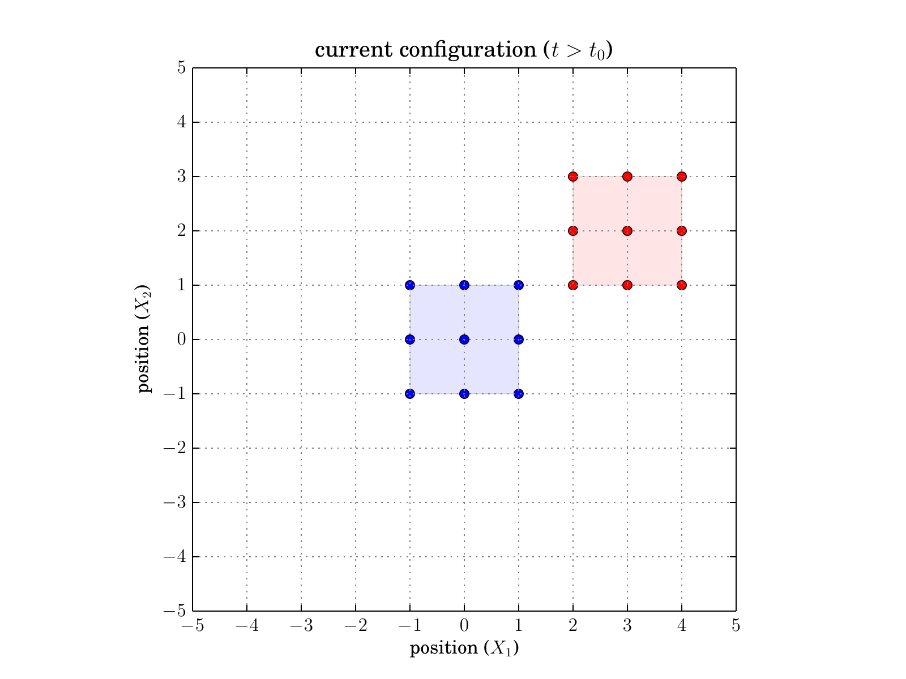

# Rigid Body Motion

## Translation

A translation is a homogeneous deformation of the form

$$
\boldsymbol{\varphi}(\boldsymbol{X}) = \bar{\boldsymbol{u}} + \boldsymbol{X}.
$$

This deformation occurs when the displacement $\boldsymbol{u}(\boldsymbol{X}, t)$ is a
constant $\bar{\boldsymbol{u}}$, and thus not a function of reference position
$\boldsymbol{X}$ or time $t$.

For the concrete example in the figure below, let $\bar{\boldsymbol{u}} = \langle
\bar{u}_1, \bar{u}_2 \rangle^{\top} = \langle 3, 2 \rangle^{\top}$. In this case,
we see the placement $\boldsymbol{\varphi}$ moves right and up on the page,
relative to the reference configuration $\boldsymbol{X}$, by an amount of 3 and 2,
respectively. The reference configuration is shown in blue. The current
configuration is shown in red.

<figure class="figure-box">
    
    <figcaption>
        Figure: Illustration of a translational motion.
    </figcaption>
</figure>
