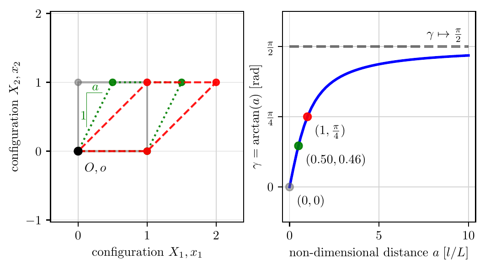

# Simple Shear

> **Note:** The source code for this section is listed [below](#source).

In this section, we cover **simple shear**,
a deformation that illustrates several concepts without
being too complicated.  That said, we will find that
simple shear isn't quite as trivial as its name would
suggest.  In fact, a paper titled
*Simple shear is not so simple*[^Destrade_2012]
reviews some details not discussed here.

The figure below illustrates simple shear, with relative motion of planes normal to the vertical axis.  For all configurations (reference and current):

* Horizontal fibers remain horizontal.
* The length of horizontal fibers remains constant.
* The vertical distance between the horizontal fibers remains constant.
* The body's volume is constant. The deformation is isochoric since $\det(\boldsymbol{F}) = 1$.

The relative motion is characterized by the non-dimensional ratio of length $a$ per unit height, where $a \in \mathbb{R} \subset [0, \infty)$.
The angle, $\gamma \in \mathbb{R} \subset [0, \pi/2)$, subtended by simple shear is $\gamma = \arctan(a)$.  In the limit as $a \mapsto \infty$, the shear angle $\gamma \mapsto \pi/2$.  For small values of $a$, the small-angle assumption is valid, with $\tan(\gamma) \approx \gamma \approx a$.

<figure class="figure-box">
    
    <figcaption>
        Figure: (Left) Simple shear of a unit cube in the reference configuration (gray)
        and two current configurations (dotted, green and dashed, red) and (right) with the
        shear angle, $\gamma$, created for all configurations that are parameterized by $a \in [0, 10]$.
    </figcaption>
</figure>

Source: [`simple_shear.py`](#simple_shearpy)

## Rate-Independent Form

The simple shear deformation $\boldsymbol{\varphi}$ in rate-independent form is

$$
\boldsymbol{\varphi}(\boldsymbol{X}) = (X_1 + a X_2) \, \boldsymbol{e}_1 + X_2 \, \boldsymbol{e}_2 + X_3 \, \boldsymbol{e}_3.
$$

The deformation gradient $\boldsymbol{F}$ is

$$
\begin{align}
\boldsymbol{F}
& := \boldsymbol{e}_i \frac{\partial \varphi_i}{\partial X_J} \boldsymbol{E}_J 
= \boldsymbol{e}_1 \otimes \boldsymbol{E}_1 + a \, \boldsymbol{e}_1 \otimes \boldsymbol{E}_2 + \boldsymbol{e}_2 \otimes \boldsymbol{E}_2 + \boldsymbol{e}_3 \otimes \boldsymbol{E}_3 \\
& = \{\boldsymbol{e}_1 \, \boldsymbol{e}_2 \, \boldsymbol{e}_3\}
\begin{bmatrix}
1 & a & 0 \\
0 & 1 & 0 \\
0 & 0 & 1
\end{bmatrix}
\left\{
\begin{matrix}
\boldsymbol{E}_1 \\
\boldsymbol{E}_2 \\
\boldsymbol{E}_3
\end{matrix}
\right\}
\;\;
\Longleftrightarrow
\;\;
\boldsymbol{F}_{iJ} = 
\begin{bmatrix}
1 & a & 0 \\
0 & 1 & 0 \\
0 & 0 & 1
\end{bmatrix}.
\end{align}
$$

Note that the volume remains constant for all deformations since $\det(\boldsymbol{F}) = 1$. The deformation thus belongs to the group of isochoric motions. The right Cauchy-Green strain, $\boldsymbol{C} := \boldsymbol{F}^T \boldsymbol{F}$, in simple shear, is

$$
\begin{align}
\boldsymbol{C} = & \boldsymbol{E}_1 \otimes \boldsymbol{E}_1 + a\, (\boldsymbol{E}_1 \otimes \boldsymbol{E}_2 + \boldsymbol{E}_2 \otimes \boldsymbol{E}_1) \;+ \nonumber \\
& (a^2 + 1) \, \boldsymbol{E}_2 \otimes \boldsymbol{E}_2 + \boldsymbol{E}_3 \otimes \boldsymbol{E}_3 
\;\;\Longleftrightarrow\;\;
\boldsymbol{C}_{IJ} = 
\begin{bmatrix}
 1 & a & 0 \\
 a & a^2+1 & 0 \\
 0 & 0 & 1
\end{bmatrix}.
\end{align}
$$

The principal directions of $\boldsymbol{C}$ are given with the three eigenvectors $\{\boldsymbol{N}_1, \boldsymbol{N}_2, \boldsymbol{N}_3\}$ and their respective eigenvalues $\lambda^2_1, \lambda^2_2, \lambda^2_3$,

$$
\boldsymbol{C} = \sum_{\alpha = 1}^3 \lambda^2_{\alpha} \, \boldsymbol{N}_{\alpha} 
\otimes \boldsymbol{N}_{\alpha}.
$$

For simple shear, the eigenvalues of $\boldsymbol{C}$ and their corresponding eigenvectors, satisfying $[\,\boldsymbol{C}\,] \{\boldsymbol{N}\} = \lambda^2 \{\boldsymbol{N}\}$, are

$$
\begin{align}
\lambda^2_1 = \frac{1}{2}\left(a^2 + a \, \sqrt{a^2 + 4} + 2\right), \quad &\text{and} \quad
\boldsymbol{N}_1 = 
\left\{\frac{1}{2}\left(-a + \sqrt{a^2 + 4} \right), \, 1, \, 0
\right\}^T; \\
%
\lambda^2_2 = 1, \quad &\text{and} \quad
\boldsymbol{N}_2 = 
\{0, \, 0, \, 1\}^T; \\
%
\lambda^2_3 = \frac{1}{2}\left(a^2 - a \, \sqrt{a^2 + 4} + 2\right), \quad &\text{and} \quad
\boldsymbol{N}_3 = 
\left\{\frac{1}{2}\left(-a - \sqrt{a^2 + 4} \right), \, 1, \, 0
\right\}^T.
\end{align}
$$

The Green-Lagrange strain, $\boldsymbol{E} := \frac{1}{2}(\boldsymbol{C} - \boldsymbol{I})$, in simple shear is

$$
\boldsymbol{E}_{IJ} = 
\frac{1}{2}
\begin{bmatrix}
 0 & a & 0 \\
 a & a^2 & 0 \\
 0 & 0 & 0
\end{bmatrix}.
$$

The left Cauchy-Green strain, $\boldsymbol{b} := \boldsymbol{F}\boldsymbol{F}^T$, (and its inverse), in simple shear, are

$$
\boldsymbol{b}_{ij} = 
\begin{bmatrix}
 a^2+1 & a & 0 \\
 a & 1 & 0 \\
 0 & 0 & 1
\end{bmatrix}, 
\;\;\text{and} \;\;
\boldsymbol{b}^{-1}_{ji} = 
\begin{bmatrix}
 1 & -a & 0 \\
 -a & a^2+1 & 0 \\
 0 & 0 & 1
\end{bmatrix}.
$$

The Almansi-Euler strain, $\boldsymbol{e} := \frac{1}{2}(\boldsymbol{I} - \boldsymbol{b}^{-1})$, for simple shear is

$$
\boldsymbol{e}_{ij} = 
\frac{1}{2}
\begin{bmatrix}
 0 & a & 0 \\
 a & -a^2 & 0 \\
 0 & 0 & 0
\end{bmatrix}.
$$

## Source

### `simple_shear.py`

```python
<!-- cmdrun cat simple_shear.py -->
```

## References

[^Destrade_2012]: Destrade M, Murphy JG, Saccomandi G. Simple shear is not so simple. International Journal of Non-Linear Mechanics. 2012 Mar 1;47(2):210-4. [download](https://doi.org/10.1016/j.ijnonlinmec.2011.05.008)
