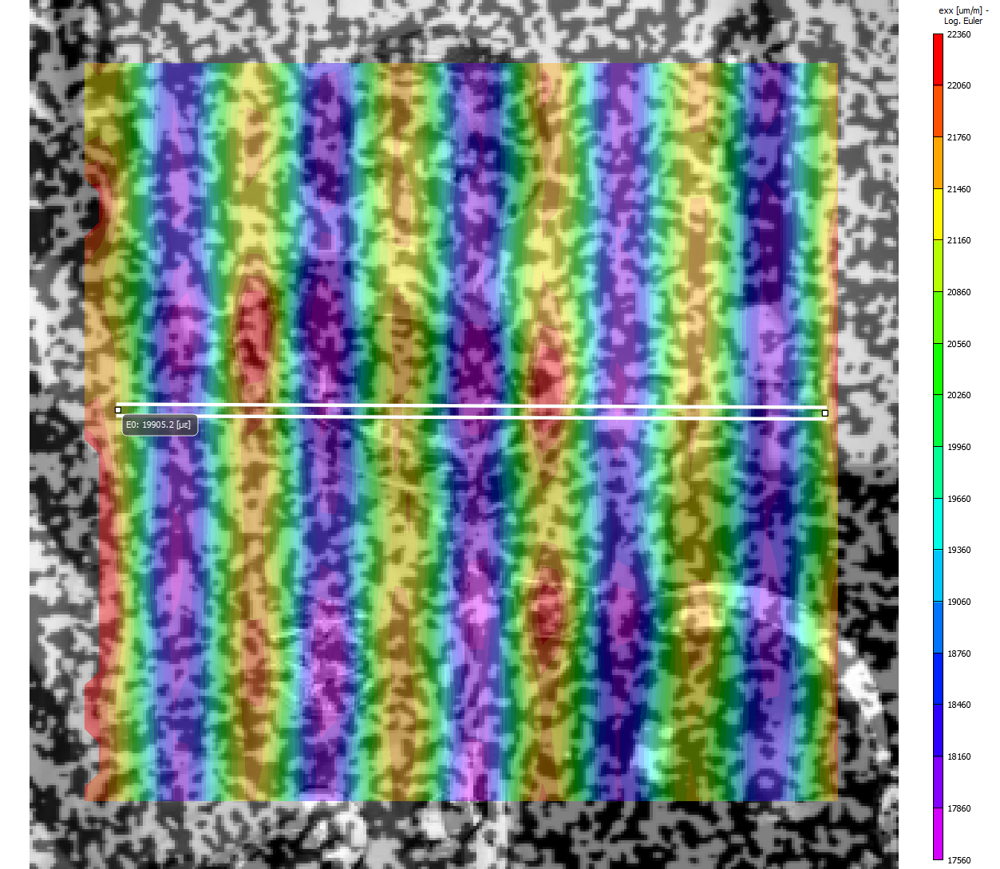

# Simple Stretch

[Multi-Point Motion](./multi_point_motion.md) tracked a grid of points under
**rigid-body translation** — every point moves by the same $(\delta x, \delta
y)$, so [Single Point Motion](./single_point_motion.md)'s known-integer-pixel
trick (choosing $\delta \boldsymbol{p} = (-6, 8)$ so the ground truth is exact,
not a sub-pixel estimate) carried over for free. A **stretch** is the next
step up in complexity: a genuine deformation, not just a rigid shift, where
different points move by different amounts. Getting the same exact-integer
ground truth here takes more care.

[`dictk.image.stretch`](../api/dictk/image.html#stretch) applies a uniaxial
or biaxial stretch pivoting at the image's origin $(0, 0)$: a point at $(x,
y)$ moves to $(x \cdot \text{factor}_x,\ y \cdot \text{factor}_y)$. Fixing
$\text{factor}_y = 1.0$ isolates the stretch to $x$ alone, so every point's
$y$ stays exactly as-is — the only question is which $\text{factor}_x$
values keep every point's *new* $x$ an integer too, rather than landing
between pixels.

## Choosing an Integer-Safe Stretch Factor

[Point Grid](./multi_point_motion.md#point-grid)'s 12 points span only three
distinct $x$ values: 50, 100, and 150. Writing the stretch as a percentage
$p$, $\text{factor}_x = (100 + p) / 100$, and the new $x$ is:

$$x \cdot \frac{100 + p}{100}$$

For $x = 100$, this is just $100 + p$ — always an integer, for any integer
$p$. But $x = 50$ and $x = 150$ both carry a factor of $\frac{1}{2}$ once
divided by 100, so $(100 + p)$ itself must be even for *those* points to
land on an integer — which means $p$ must be even. Odd percentages (1%, 3%,
5%, ...) always leave $x = 50$ and $x = 150$ on a half-pixel.

That parity argument is exact in real-number math, but `factor_x` is a
64-bit float at runtime, and not every value that's mathematically an
integer survives that arithmetic unscathed — 1.1, for example, has no exact
binary floating-point representation, so `50 * 1.1` doesn't land on exactly
`55.0` even though the true product is. Checking every even percentage
directly against `dictk`'s actual points, rather than trusting the parity
argument alone:

```python
from dictk.image import PixelCoordinate
from dictk.grid import generate

points = generate(
    origin=PixelCoordinate(x=50, y=50),
    count_x=3,
    count_y=4,
    spacing_x=50,
    spacing_y=55,
)
xs = sorted({point.x for point in points})

for p in range(1, 21):
    factor = (100 + p) / 100
    exact = all((x * factor).is_integer() for x in xs)
    print(f"{p:2d}%  factor={factor!r}  all-integer={exact}")
```

```text
<!-- cmdrun python3 -c "from dictk.image import PixelCoordinate; from dictk.grid import generate; points = generate(origin=PixelCoordinate(x=50, y=50), count_x=3, count_y=4, spacing_x=50, spacing_y=55); xs = sorted({point.x for point in points}); [print(f'{p:2d}%  factor={(100 + p) / 100!r}  all-integer={all((x * ((100 + p) / 100)).is_integer() for x in xs)}') for p in range(1, 21)]" -->
```

The parity argument is necessary but not sufficient: every odd percentage
fails as predicted, but so do several even ones (10%, 12%, 14%, 16%) purely
from floating-point representation error, not the underlying math. Of the
percentages that survive both checks, **2% is the smallest** — the least
aggressive stretch that still keeps every point's ground-truth position an
exact pixel, with `factor_x = 1.02` giving new $x$ values of 51, 102, and
153.

## Applying the Stretch

Reuse `points` and `reference_image` from [Point
Grid](./multi_point_motion.md#point-grid).
[`dictk.image.stretch`](../api/dictk/image.html#stretch) builds `current_image`:

```python
from dictk.image import read, stretch, PixelCoordinate

reference_image = read(path="astronaut0.png")
factor_x = 1.02
current_image = stretch(arr=reference_image, factor_x=factor_x)
```

`factor_y` defaults to `1.0`. Every point's $y$ stays fixed. Only $x$
changes, and by a different amount for each point:

```python
expected = [
    PixelCoordinate(x=int(point.x * factor_x), y=point.y)
    for point in points
]
```

<!-- cmdrun python3 -c "from dictk.image import PixelCoordinate; from dictk.grid import generate; points = generate(origin=PixelCoordinate(x=50, y=50), count_x=3, count_y=4, spacing_x=50, spacing_y=55); factor_x = 1.02; expected = [PixelCoordinate(x=int(p.x * factor_x), y=p.y) for p in points]; print('<table>'); print('<thead>'); print('<tr><th rowspan=\"2\">Point</th><th colspan=\"2\">Reference Configuration \$(X, Y)\$</th><th colspan=\"2\">Expected \$(x, y)\$</th></tr>'); print('<tr><th>\$X\$ (pixels)</th><th>\$Y\$ (pixels)</th><th>\$x\$ (pixels)</th><th>\$y\$ (pixels)</th></tr>'); print('</thead>'); print('<tbody>'); [print(f'<tr><td>{i:02d}</td><td>{p.x}</td><td>{p.y}</td><td>{e.x}</td><td>{e.y}</td></tr>') for i, (p, e) in enumerate(zip(points, expected))]; print('</tbody>'); print('</table>')" -->

This is a real deformation, not a rigid shift. [Multi-Point
Motion](./multi_point_motion.md) moved every point by the same $(\delta x,
\delta y)$. A stretch moves each point by a different amount. A point at
$x = 50$ moves 1 pixel. A point at $x = 150$ moves 3 pixels. The grid
spreads apart under the stretch. It does not translate as one block.

## Locating the Stretched Grid

[`dictk.grid.locate`](../api/dictk/grid.html#locate) tracks the stretched
grid the same way it tracked the translated one in [Tracking the
Grid](./multi_point_motion.md#tracking-the-grid). Reuse the same kernel
and search-area margins:

```python
from dictk.grid import locate

found = locate(
    reference_image=reference_image,
    current_image=current_image,
    reference_points=points,
    kernel_margin_width=20,
    kernel_margin_height=20,
    search_margin_width=48,
    search_margin_height=52,
)
```

```text
<!-- cmdrun python3 -c "from dictk.image import read, PixelCoordinate, stretch; from dictk.grid import generate, locate; reference_image = read(path='astronaut0.png'); points = generate(origin=PixelCoordinate(x=50, y=50), count_x=3, count_y=4, spacing_x=50, spacing_y=55); factor_x = 1.02; current_image = stretch(arr=reference_image, factor_x=factor_x); expected = [PixelCoordinate(x=int(p.x * factor_x), y=p.y) for p in points]; found = locate(reference_image=reference_image, current_image=current_image, reference_points=points, kernel_margin_width=20, kernel_margin_height=20, search_margin_width=48, search_margin_height=52); print('Point  found        expected     match'); [print(f'{i:02d}     {f.x:4d},{f.y:<4d}   {e.x:4d},{e.y:<4d}   {f == e}') for i, (f, e) in enumerate(zip(found, expected))]" -->
```

```python
from dictk.plot import point_grid_plot

point_grid_plot(
    image=current_image,
    points=found,
    color="orange",
    figsize=(6.4, 4.8),
    path="simple_stretch_current.png",
)
```

```text
<!-- cmdrun python3 -c "from dictk.image import read, PixelCoordinate, stretch; from dictk.plot import point_grid_plot; from dictk.grid import generate, locate; reference_image = read(path='astronaut0.png'); points = generate(origin=PixelCoordinate(x=50, y=50), count_x=3, count_y=4, spacing_x=50, spacing_y=55); factor_x = 1.02; current_image = stretch(arr=reference_image, factor_x=factor_x); found = locate(reference_image=reference_image, current_image=current_image, reference_points=points, kernel_margin_width=20, kernel_margin_height=20, search_margin_width=48, search_margin_height=52); point_grid_plot(image=current_image, points=found, color='orange', figsize=(6.4, 4.8), path='simple_stretch_current.png'); print('Saved: simple_stretch_current.png')" -->
```

<figure>
    
    <figcaption>The stretched current image, with all 12 found positions marked. Every found position matches its expected stretched position exactly.</figcaption>
</figure>

Every found position matches the expected stretched position exactly.
The stretch introduces no sub-pixel error at these 12 points. [Multi-Point
Motion](./multi_point_motion.md) established this exact-integer guarantee
for rigid translation. This page confirms it holds under a real
deformation too.

Twelve points, twelve independent correlations, whether the underlying
motion is a rigid shift or a stretch:
[Recoverable Displacement Range](./recoverable_displacement_range.md) picks
up from here.

## Strain

Visualizing strain results is a combination of mathematical accuracy and
visual clarity. One might want to plot the "raw" data at the Gauss
points, since that is the location within the element where the FEA
solver actually calculates strain, making it the most accurate.
However, this manner of visualization causes jumps (discontinuities) at
element boundaries.

The professional standard is to calculate strain at the Gauss points,
extrapolate the results to the nodes, and then report the **nodal
average** from all adjacent elements to create a smooth contour plot.

For now, let's report the strain at the Gauss points.

### 12-Point Sample

[`dictk.grid.elements`](../api/dictk/grid.html#elements) turns the
tracked grid's 12 points into 6 Q4 elements, then
[`dictk.element.gauss_point_log_strains`](../api/dictk/element.html#gauss_point_log_strains)
and
[`dictk.element.gauss_point_coordinates`](../api/dictk/element.html#gauss_point_coordinates)
compute each element's 4 Gauss points' logarithmic (Hencky) strain and
their own global position, in the current (found) configuration.
Logarithmic strain, matching the [Verification Against
VIC-2D](#verification-against-vic-2d) section below, which reports
VIC-2D's own logarithmic/Euler strain:

```python
from dictk.element import gauss_point_coordinates, gauss_point_log_strains
from dictk.grid import elements
from dictk.plot import element_strain_plot

element_indices = elements(count_x=3, count_y=4)
values = []
coordinates = []
for element in element_indices:
    reference_corners = [points[i] for i in element]
    current_corners = [found[i] for i in element]
    strains = gauss_point_log_strains(
        reference_points=reference_corners, current_points=current_corners
    )
    values.extend(strain[0, 0] for strain in strains)
    coordinates.extend(gauss_point_coordinates(points=current_corners))

element_strain_plot(
    points=found,
    elements=element_indices,
    coordinates=coordinates,
    values=values,
    label=r"Log Strain, $E_{11}$",
    show_node_numbers=True,
    path="simple_stretch_strain_gauss_points.png",
)
element_strain_plot(
    points=found,
    elements=element_indices,
    coordinates=coordinates,
    values=values,
    label=r"Log Strain, $E_{11}$",
    image=current_image,
    show_node_numbers=True,
    path="simple_stretch_strain_on_current.png",
)
```

<!-- cmdrun python3 -c "from dictk.image import read, PixelCoordinate, stretch; from dictk.plot import element_strain_plot; from dictk.grid import generate, locate, elements; from dictk.element import gauss_point_coordinates, gauss_point_log_strains; reference_image = read(path='astronaut0.png'); points = generate(origin=PixelCoordinate(x=50, y=50), count_x=3, count_y=4, spacing_x=50, spacing_y=55); factor_x = 1.02; current_image = stretch(arr=reference_image, factor_x=factor_x); found = locate(reference_image=reference_image, current_image=current_image, reference_points=points, kernel_margin_width=20, kernel_margin_height=20, search_margin_width=48, search_margin_height=52); element_indices = elements(count_x=3, count_y=4); values, coordinates = [], []; [ (values.extend(strain[0, 0] for strain in gauss_point_log_strains(reference_points=[points[i] for i in element], current_points=[found[i] for i in element])), coordinates.extend(gauss_point_coordinates(points=[found[i] for i in element]))) for element in element_indices ]; element_strain_plot(points=found, elements=element_indices, coordinates=coordinates, values=values, label=r'Log Strain, \$E_{11}\$', show_node_numbers=True, path='simple_stretch_strain_gauss_points.png'); element_strain_plot(points=found, elements=element_indices, coordinates=coordinates, values=values, label=r'Log Strain, \$E_{11}\$', image=current_image, show_node_numbers=True, path='simple_stretch_strain_on_current.png')" -->

<figure>
    
    <figcaption>The 6-element mesh, node numbers and Gauss points colored by log strain $E_{11}$.</figcaption>
</figure>

<figure>
    
    <figcaption>The same mesh, overlaid on <code>current_image</code>.</figcaption>
</figure>

```text
<!-- cmdrun python3 -c "from dictk.image import read, PixelCoordinate, stretch; from dictk.grid import generate, locate, elements; from dictk.element import gauss_points, gauss_point_log_strains; reference_image = read(path='astronaut0.png'); points = generate(origin=PixelCoordinate(x=50, y=50), count_x=3, count_y=4, spacing_x=50, spacing_y=55); factor_x = 1.02; current_image = stretch(arr=reference_image, factor_x=factor_x); found = locate(reference_image=reference_image, current_image=current_image, reference_points=points, kernel_margin_width=20, kernel_margin_height=20, search_margin_width=48, search_margin_height=52); element_indices = elements(count_x=3, count_y=4); print('Strain Component: E11'); print('-' * 40); [print(f'Element {i:2d} | GP (xi={xi:+.3f}, eta={eta:+.3f}) | E11: {strain[0, 0]:.6e}') for i, element in enumerate(element_indices) for (xi, eta), strain in zip(gauss_points(), gauss_point_log_strains(reference_points=[points[j] for j in element], current_points=[found[j] for j in element]))]; print('-' * 40)" -->
```

All 24 Gauss points report the identical value, $E_{11} \approx 0.019803$
— expected here, since `factor_x = 1.02` is a uniform, axis-aligned
stretch, a globally affine map that Q4's bilinear interpolation
reproduces exactly everywhere, not just at element corners. In the
general case, where the deformation isn't perfectly uniform, each Gauss
point's strain would differ.

## Data Download

Every image this page used is downloadable below, as a TIFF. Download
files individually, or all at once: one compressed zip file bundles
every full image (reference and current), every kernel, and every
search area.

```python
import zipfile
import imageio.v3 as iio

images = {"astronaut0.tiff": reference_image, "astronaut2.tiff": current_image}
for i, point in enumerate(points):
    origin = PixelCoordinate(x=point.x - kernel_margin, y=point.y - kernel_margin)
    images[f"kernel_{i:02d}.tiff"] = subimage(
        image=reference_image, origin=origin, width=2 * kernel_margin, height=2 * kernel_margin
    )
for i, point in enumerate(points):
    origin = PixelCoordinate(x=point.x - search_margin_width, y=point.y - search_margin_height)
    images[f"search_area_stretch_{i:02d}.tiff"] = subimage(
        image=current_image, origin=origin, width=2 * search_margin_width, height=2 * search_margin_height
    )

with zipfile.ZipFile("simple_stretch_data.zip", "w", zipfile.ZIP_DEFLATED) as zf:
    for name, arr in images.items():
        zf.writestr(name, iio.imwrite("<bytes>", arr, extension=".tiff"))
```

<!-- cmdrun python3 -c "import zipfile, os; import imageio.v3 as iio; from dictk.image import read, PixelCoordinate, stretch, subimage; from dictk.grid import generate; reference_image = read(path='astronaut0.png'); factor_x = 1.02; current_image = stretch(arr=reference_image, factor_x=factor_x); points = generate(origin=PixelCoordinate(x=50, y=50), count_x=3, count_y=4, spacing_x=50, spacing_y=55); kernel_margin = 20; search_margin_width, search_margin_height = 48, 52; images = {'astronaut0.tiff': reference_image, 'astronaut2.tiff': current_image}; [images.__setitem__(f'kernel_{i:02d}.tiff', subimage(image=reference_image, origin=PixelCoordinate(x=p.x - kernel_margin, y=p.y - kernel_margin), width=2 * kernel_margin, height=2 * kernel_margin)) for i, p in enumerate(points)]; [images.__setitem__(f'search_area_stretch_{i:02d}.tiff', subimage(image=current_image, origin=PixelCoordinate(x=p.x - search_margin_width, y=p.y - search_margin_height), width=2 * search_margin_width, height=2 * search_margin_height)) for i, p in enumerate(points)]; zf = zipfile.ZipFile('simple_stretch_data.zip', 'w', zipfile.ZIP_DEFLATED); [zf.writestr(name, iio.imwrite('<bytes>', arr, extension='.tiff')) for name, arr in images.items()]; zf.close(); size_kb = os.path.getsize('simple_stretch_data.zip') / 1024; print(f'**Download all**: [simple_stretch_data.zip](simple_stretch_data.zip) ({len(images)} files, {size_kb:.0f} KB)')" -->

### Full Images

`astronaut0.tiff` is `reference_image` — identical to [Multi-Point
Motion's](./multi_point_motion.md#full-images) copy, since both pages
reuse the same reference image. `astronaut2.tiff` is `current_image`,
stretched by `factor_x=1.02` — named `astronaut2`, not `astronaut1`, to
stay distinct from Multi-Point Motion's *translated* current image,
which is a different file with different content:

```python
from dictk.image import write

write(arr=reference_image, path="astronaut0.tiff")
write(arr=current_image, path="astronaut2.tiff")
```

<!-- cmdrun python3 -c "from dictk.image import read, PixelCoordinate, stretch, write; from dictk.grid import generate; reference_image = read(path='astronaut0.png'); factor_x = 1.02; current_image = stretch(arr=reference_image, factor_x=factor_x); write(arr=reference_image, path='astronaut0.tiff'); write(arr=current_image, path='astronaut2.tiff'); print('| File | Description |'); print('|---|---|'); print('| [astronaut0.tiff](astronaut0.tiff) | Reference image, 300x300 pixels (same as Multi-Point Motion) |'); print(f'| [astronaut2.tiff](astronaut2.tiff) | Current image, stretched by factor_x={factor_x} |')" -->

### Kernels

Kernels are unchanged from [Multi-Point
Motion](./multi_point_motion.md#kernels): the stretch only ever moves
`current_image`, and a kernel always comes from `reference_image`.
Regenerated here, byte-for-byte identical, for a self-contained download
set:

```python
from dictk.image import subimage, write

kernel_margin = 20
for i, point in enumerate(points):
    origin = PixelCoordinate(x=point.x - kernel_margin, y=point.y - kernel_margin)
    kernel = subimage(image=reference_image, origin=origin, width=2 * kernel_margin, height=2 * kernel_margin)
    write(arr=kernel, path=f"kernel_{i:02d}.tiff")
```

<!-- cmdrun python3 -c "from dictk.image import read, PixelCoordinate, subimage, write; from dictk.grid import generate; reference_image = read(path='astronaut0.png'); points = generate(origin=PixelCoordinate(x=50, y=50), count_x=3, count_y=4, spacing_x=50, spacing_y=55); kernel_margin = 20; print('| File | Point | Origin (pixels) |'); print('|---|---|---|'); [ (lambda origin, kernel: (write(arr=kernel, path=f'kernel_{i:02d}.tiff'), print(f'| [kernel_{i:02d}.tiff](kernel_{i:02d}.tiff) | {i:02d} | ({origin.x}, {origin.y}) |')))(PixelCoordinate(x=p.x - kernel_margin, y=p.y - kernel_margin), subimage(image=reference_image, origin=PixelCoordinate(x=p.x - kernel_margin, y=p.y - kernel_margin), width=2 * kernel_margin, height=2 * kernel_margin)) for i, p in enumerate(points) ]" -->

### Search Areas

Search areas, unlike kernels, *are* different from Multi-Point Motion's:
they come from this page's `current_image` — the stretched one, not the
translated one. Named `search_area_stretch_*` to keep the two sets of
files distinct, still centered on each point's reference position:

```python
search_margin_width, search_margin_height = 48, 52
for i, point in enumerate(points):
    origin = PixelCoordinate(x=point.x - search_margin_width, y=point.y - search_margin_height)
    search_area = subimage(image=current_image, origin=origin, width=2 * search_margin_width, height=2 * search_margin_height)
    write(arr=search_area, path=f"search_area_stretch_{i:02d}.tiff")
```

<!-- cmdrun python3 -c "from dictk.image import read, PixelCoordinate, stretch, subimage, write; from dictk.grid import generate; reference_image = read(path='astronaut0.png'); points = generate(origin=PixelCoordinate(x=50, y=50), count_x=3, count_y=4, spacing_x=50, spacing_y=55); factor_x = 1.02; current_image = stretch(arr=reference_image, factor_x=factor_x); search_margin_width, search_margin_height = 48, 52; print('| File | Point | Origin (pixels) |'); print('|---|---|---|'); [ (lambda origin, search_area: (write(arr=search_area, path=f'search_area_stretch_{i:02d}.tiff'), print(f'| [search_area_stretch_{i:02d}.tiff](search_area_stretch_{i:02d}.tiff) | {i:02d} | ({origin.x}, {origin.y}) |')))(PixelCoordinate(x=p.x - search_margin_width, y=p.y - search_margin_height), subimage(image=current_image, origin=PixelCoordinate(x=p.x - search_margin_width, y=p.y - search_margin_height), width=2 * search_margin_width, height=2 * search_margin_height)) for i, p in enumerate(points) ]" -->

## Verification Against VIC-2D

[Path Forward](./path_forward.md#2026-08-11) names a direction worth
pursuing: running this book's own synthetic datasets through established
DIC software, and comparing directly against `dictk`'s own results. This
page's own `factor_x = 1.02` stretch was run through
[VIC-2D](https://www.correlatedsolutions.com/vic-2d/) (Correlated
Solutions, Inc.), independently of `dictk`.

### 2682-Point Sample

VIC-2D placed its own subsets on a regular grid, 5 pixels apart in both
directions — 53x54, 2862 candidate positions across the image. 180 of
them sit close enough to the image's outer edge that their own
correlation window would run off-canvas, so VIC-2D masks those out,
leaving 2682 valid subsets.

```python
from dictk.image import read, PixelCoordinate
from dictk.grid import generate
from dictk.plot import point_grid_plot

reference_image = read(path="astronaut0.png")
points = generate(
    origin=PixelCoordinate(x=18, y=16), count_x=53, count_y=54, spacing_x=5, spacing_y=5
)

# Marks exactly the region the zoomed-in figure below crops to -- same
# center and radius drawn there too, where it exactly touches all four
# edges of that figure's own extent.
crop_origin = PixelCoordinate(x=10, y=8)
crop_width, crop_height = 30, 30
circle_center = PixelCoordinate(
    x=crop_origin.x + crop_width // 2, y=crop_origin.y + crop_height // 2
)
circle_radius = crop_width / 2

point_grid_plot(
    image=reference_image,
    points=points,
    color="orange",
    show_node_numbers=False,
    dot_size=0.8,
    circle_center=circle_center,
    circle_radius=circle_radius,
    circle_linewidth=0.8,
    path="simple_stretch_2862_overview.png",
)
```

<!-- cmdrun python3 -c "from dictk.image import read, PixelCoordinate; from dictk.grid import generate; from dictk.plot import point_grid_plot; reference_image = read(path='astronaut0.png'); points = generate(origin=PixelCoordinate(x=18, y=16), count_x=53, count_y=54, spacing_x=5, spacing_y=5); crop_origin = PixelCoordinate(x=10, y=8); crop_width, crop_height = 30, 30; circle_center = PixelCoordinate(x=crop_origin.x + crop_width // 2, y=crop_origin.y + crop_height // 2); circle_radius = crop_width / 2; point_grid_plot(image=reference_image, points=points, color='orange', show_node_numbers=False, dot_size=0.8, circle_center=circle_center, circle_radius=circle_radius, circle_linewidth=0.8, path='simple_stretch_2862_overview.png'); print('Saved: simple_stretch_2862_overview.png')" -->

<figure>
    
    <figcaption>All 2862 candidate subset positions (orange dots, 5px spacing in both directions), overlaid on the reference image. The red circle marks the region the zoomed-in figure below crops to.</figcaption>
</figure>

A zoomed-in corner shows the same 5px grid at true scale, the same red
circle now exactly touching all four edges of the crop:

```python
from dictk.image import read, PixelCoordinate, subimage
from dictk.grid import generate
from dictk.plot import point_grid_plot

reference_image = read(path="astronaut0.png")
points = generate(
    origin=PixelCoordinate(x=18, y=16), count_x=53, count_y=54, spacing_x=5, spacing_y=5
)

crop_origin = PixelCoordinate(x=10, y=8)
crop_width, crop_height = 30, 30
circle_center = PixelCoordinate(
    x=crop_origin.x + crop_width // 2, y=crop_origin.y + crop_height // 2
)
circle_radius = crop_width / 2

cropped = subimage(
    image=reference_image, origin=crop_origin, width=crop_width, height=crop_height
)
# points stays in the full image's own frame -- origin=crop_origin tells
# point_grid_plot where cropped sits within it, so the saved figure's
# axes read astronaut0's own pixel numbers, not the crop's local 0-based
# ones. The same point (and the same circle) reads identically here and
# in the overview above.
sample_points = [
    p
    for p in points
    if crop_origin.x <= p.x < crop_origin.x + crop_width
    and crop_origin.y <= p.y < crop_origin.y + crop_height
]
point_grid_plot(
    image=cropped,
    points=sample_points,
    origin=crop_origin,
    color="orange",
    show_node_numbers=False,
    dot_size=6,
    circle_center=circle_center,
    circle_radius=circle_radius,
    circle_linewidth=0.8,
    figsize=(4, 4),
    path="simple_stretch_2862_zoom.png",
)
```

<!-- cmdrun python3 -c "from dictk.image import read, PixelCoordinate, subimage; from dictk.grid import generate; from dictk.plot import point_grid_plot; reference_image = read(path='astronaut0.png'); points = generate(origin=PixelCoordinate(x=18, y=16), count_x=53, count_y=54, spacing_x=5, spacing_y=5); crop_origin = PixelCoordinate(x=10, y=8); crop_width, crop_height = 30, 30; circle_center = PixelCoordinate(x=crop_origin.x + crop_width // 2, y=crop_origin.y + crop_height // 2); circle_radius = crop_width / 2; cropped = subimage(image=reference_image, origin=crop_origin, width=crop_width, height=crop_height); sample_points = [p for p in points if crop_origin.x <= p.x < crop_origin.x + crop_width and crop_origin.y <= p.y < crop_origin.y + crop_height]; point_grid_plot(image=cropped, points=sample_points, origin=crop_origin, color='orange', show_node_numbers=False, dot_size=6, circle_center=circle_center, circle_radius=circle_radius, circle_linewidth=0.8, figsize=(4, 4), path='simple_stretch_2862_zoom.png'); print('Saved: simple_stretch_2862_zoom.png')" -->

<figure>
    
    <figcaption>A 30x30-pixel crop from the top-left corner (image coordinates 10-40 in both directions), showing every one of the 25 grid points that fall inside it -- the same 5px spacing as the full overview above, just at true scale instead of compressed into a 300x300 thumbnail. The axes read <code>astronaut0</code>'s own pixel coordinates, not the crop's local 0-based ones, so a point here reads identically in the overview above -- e.g. the top-left point is <code>(18, 16)</code> in both figures. The same red circle marked in the overview above appears here too, now exactly touching all four edges of this figure's own extent -- the same visual correspondence <a href="./correlation_visualization.html">Correlation Visualization</a>'s Solution Vicinity panel uses.</figcaption>
</figure>

VIC-2D reports logarithmic (Euler) strain, so it's compared here
against [the Strain section](#strain) above's own `dictk`-computed log
strain. Across those 2682 valid subsets, $e_{xx}$ averages
19875.8 microstrain — close to, but noisier than,
[Multi-Point Motion](./multi_point_motion.md#verification-against-vic-2d)'s
displacement match, since strain is a spatial derivative of already-noisy
per-point displacement data, not a directly measured quantity:

<figure>
    <a href="../verification/simple_stretch_result_vic.png" target="_blank" rel="noopener">
        
    </a>
    <figcaption>VIC-2D's own measured $e_{xx}$ (logarithmic/Euler strain) field for this page's <code>factor_x = 1.02</code> stretch (click to enlarge). The horizontal line is VIC-2D's own extensometer annotation, reading 19905.2 microstrain along that path.</figcaption>
</figure>

The full distribution, not just its mean, shows how noisy those 2682
subsets really are:

```python
import csv
import numpy as np
import matplotlib.pyplot as plt

with open("../verification/simple_stretch_vic_out.csv") as f:
    rows = [{k.strip(' "'): v for k, v in row.items()} for row in csv.DictReader(f)]
exx = np.array([float(r["exx"]) * 1e6 for r in rows if float(r["sigma"]) != -1])
analytical = np.log(1.02) * 1e6

plt.rcParams.update({"font.family": "serif", "mathtext.fontset": "cm"})
fig, ax = plt.subplots(figsize=(7, 4), constrained_layout=True)
ax.hist(exx, bins=60, color="gray", alpha=0.8)
ax.axvline(analytical, color="red", linestyle="--", linewidth=1.5)
ax.set_xlabel(r"Log strain $e_{xx}$ (microstrain)")
ax.set_ylabel("frequency")
fig.savefig("simple_stretch_vic_exx_histogram.png", dpi=300)
```

```text
<!-- cmdrun python3 -c "import csv; import numpy as np; import matplotlib.pyplot as plt; rows = [{k.strip(' \"'): v for k, v in row.items()} for row in csv.DictReader(open('../verification/simple_stretch_vic_out.csv'))]; exx = np.array([float(r['exx']) * 1e6 for r in rows if float(r['sigma']) != -1]); analytical = np.log(1.02) * 1e6; plt.rcParams.update({'font.family': 'serif', 'mathtext.fontset': 'cm'}); fig, ax = plt.subplots(figsize=(7, 4), constrained_layout=True); ax.hist(exx, bins=60, color='gray', alpha=0.8); ax.axvline(analytical, color='red', linestyle='--', linewidth=1.5); ax.set_xlabel(r'Log strain \$e_{xx}\$ (microstrain)'); ax.set_ylabel('frequency'); fig.savefig('simple_stretch_vic_exx_histogram.png', dpi=300); print('Saved: simple_stretch_vic_exx_histogram.png')" -->
```

<figure>
    
    <figcaption>Distribution of VIC-2D's own $e_{xx}$ across all 2682 valid subsets (gray, 60 bins). The dashed red line marks the analytical value, $e_{xx} = \ln(1.02) \approx 19803$ microstrain. The distribution isn't one smooth bell curve — it separates into several clusters, echoing the striped pattern already visible in the field image above. The analytical line lands inside the central cluster, not at the extremes, but the spread around it is real: individual subsets range from about 17300 to 23100 microstrain, over 5x the true 19803 value's own distance from zero.</figcaption>
</figure>

Three values agree closely: VIC-2D's own measured mean, 19875.8
microstrain; `dictk`'s own computed $E_{11}$ from the Strain section
above, 19803.0 microstrain (identical at all 24 Gauss points, since
this page's stretch is exact and uniform); and the analytical
logarithmic (true/Euler) strain a `factor_x = 1.02` stretch implies,
$\ln(1.02) \approx 19802.6$ microstrain.

`dictk`'s own value lands within 0.02% of the analytical one — it's
derived from the exact-integer tracked positions established earlier
on this page, not a separately measured quantity, so it agrees almost
exactly. VIC-2D's own mean, measured from real correlated subsets
rather than exact tracked points, lands within 0.4% of the same
analytical value.

The full, subset-by-subset VIC-2D output —
[`simple_stretch_vic_out.csv`](../verification/simple_stretch_vic_out.csv)
— is available for closer inspection: every subset's position,
displacement, strain, and correlation quality metrics, not just the
summary field shown above.

VIC-2D sampled this deformation at far higher density than `dictk`
has tried. [Simple Stretch Revisited](#simple-stretch-revisited) takes
that cue next, pushing `dictk`'s own tracked grid past twelve points
for the first time.

## Simple Stretch Revisited

Every point tracked so far on this page has landed on an exact integer
pixel in the deformed configuration. That only works because of how
the 12-point grid's own $x$ values were chosen. $\text{factor}_x =
1.02$ is $51/50$. A point's stretched $x$ only comes out as a whole
number when $x$ itself is a multiple of 50 — $50 \cdot 51/50 = 51$,
exactly, but $51 \cdot 51/50 = 52.02$, not exactly. The grid's three
distinct $x$ values, 50, 100, and 150, are all multiples of 50. That's
not a coincidence — it's the same integer-safety check [Choosing an
Integer-Safe Stretch Factor](#choosing-an-integer-safe-stretch-factor)
already ran, just not stated in exactly these terms yet.

A much denser grid doesn't automatically keep that property. Spacing
points 5 pixels apart, matching VIC-2D's own subset grid, mostly
lands on $x$ values that aren't multiples of 50 — most of those points'
true stretched position isn't an integer at all, so nothing can land on
it exactly, no matter how the tracking works.

### 250-Point Sample

$\text{factor}_y = 1.0$ has no such restriction — every $y$ stays fixed,
so $y$ spacing is free. That leaves one real lever: keep $x$ restricted
to multiples of 50, and pack the $y$ direction as densely as space
allows. Within this image, $x \in \{50, 100, 150, 200, 250\}$ — 5
values, still 50 pixels apart, and (with `search_margin_width=48`) all
comfortably clear of the image's own edges. A much larger, still fully
integer-safe grid follows directly:

```python
from dictk.grid import generate

points = generate(
    origin=PixelCoordinate(x=50, y=52),
    count_x=5,
    count_y=50,
    spacing_x=50,
    spacing_y=4,
)
```

<!-- cmdrun python3 -c "from dictk.image import PixelCoordinate; from dictk.grid import generate; points = generate(origin=PixelCoordinate(x=50, y=52), count_x=5, count_y=50, spacing_x=50, spacing_y=4); xs = sorted({p.x for p in points}); print(f'{len(points)} points, x values: {xs}, y range: {min(p.y for p in points)}-{max(p.y for p in points)}')" -->

Tracked the same way as every other grid on this page:

```python
from dictk.grid import locate

found = locate(
    reference_image=reference_image,
    current_image=current_image,
    reference_points=points,
    kernel_margin_width=20,
    kernel_margin_height=20,
    search_margin_width=48,
    search_margin_height=52,
)
```

<!-- cmdrun python3 -c "from dictk.image import read, PixelCoordinate, stretch; from dictk.grid import generate, locate; reference_image = read(path='astronaut0.png'); points = generate(origin=PixelCoordinate(x=50, y=52), count_x=5, count_y=50, spacing_x=50, spacing_y=4); factor_x = 1.02; current_image = stretch(arr=reference_image, factor_x=factor_x); found = locate(reference_image=reference_image, current_image=current_image, reference_points=points, kernel_margin_width=20, kernel_margin_height=20, search_margin_width=48, search_margin_height=52); expected = [PixelCoordinate(x=int(p.x * factor_x), y=p.y) for p in points]; matches = sum(1 for f, e in zip(found, expected) if f == e); print(f'{matches}/{len(points)} points land on their expected integer pixel exactly')" -->

Every one of them lands exactly, the same as the 12-point grid — this
grid is 20x larger, entirely by choosing $x$ values that stay
integer-safe, not by luck.

Strain follows the same recipe as [the Strain section](#strain) above:
[`dictk.grid.elements`](../api/dictk/grid.html#elements) for
connectivity, then
[`dictk.element.gauss_point_log_strains`](../api/dictk/element.html#gauss_point_log_strains)
and
[`dictk.element.gauss_point_coordinates`](../api/dictk/element.html#gauss_point_coordinates)
at each of the resulting 196 elements' Gauss points. Node numbers are
left off this time — 250 labels would be clutter, not information, at
this density:

```python
from dictk.element import gauss_point_coordinates, gauss_point_log_strains
from dictk.grid import elements
from dictk.plot import element_strain_plot

element_indices = elements(count_x=5, count_y=50)
values = []
coordinates = []
for element in element_indices:
    reference_corners = [points[i] for i in element]
    current_corners = [found[i] for i in element]
    strains = gauss_point_log_strains(
        reference_points=reference_corners, current_points=current_corners
    )
    values.extend(strain[0, 0] for strain in strains)
    coordinates.extend(gauss_point_coordinates(points=current_corners))

element_strain_plot(
    points=found,
    elements=element_indices,
    coordinates=coordinates,
    values=values,
    label=r"Log Strain, $E_{11}$",
    path="simple_stretch_revisited_strain_gauss_points.png",
)
element_strain_plot(
    points=found,
    elements=element_indices,
    coordinates=coordinates,
    values=values,
    label=r"Log Strain, $E_{11}$",
    image=current_image,
    path="simple_stretch_revisited_strain_on_current.png",
)
```

<!-- cmdrun python3 -c "from dictk.image import read, PixelCoordinate, stretch; from dictk.plot import element_strain_plot; from dictk.grid import generate, locate, elements; from dictk.element import gauss_point_coordinates, gauss_point_log_strains; reference_image = read(path='astronaut0.png'); points = generate(origin=PixelCoordinate(x=50, y=52), count_x=5, count_y=50, spacing_x=50, spacing_y=4); factor_x = 1.02; current_image = stretch(arr=reference_image, factor_x=factor_x); found = locate(reference_image=reference_image, current_image=current_image, reference_points=points, kernel_margin_width=20, kernel_margin_height=20, search_margin_width=48, search_margin_height=52); element_indices = elements(count_x=5, count_y=50); values, coordinates = [], []; [ (values.extend(strain[0, 0] for strain in gauss_point_log_strains(reference_points=[points[i] for i in element], current_points=[found[i] for i in element])), coordinates.extend(gauss_point_coordinates(points=[found[i] for i in element]))) for element in element_indices ]; element_strain_plot(points=found, elements=element_indices, coordinates=coordinates, values=values, label=r'Log Strain, \$E_{11}\$', path='simple_stretch_revisited_strain_gauss_points.png'); element_strain_plot(points=found, elements=element_indices, coordinates=coordinates, values=values, label=r'Log Strain, \$E_{11}\$', image=current_image, path='simple_stretch_revisited_strain_on_current.png')" -->

<figure>
    
    <figcaption>The same log strain $E_{11}$, at 196 elements instead of 6 -- close enough to continuous to start looking like a real strain field.</figcaption>
</figure>

<figure>
    
    <figcaption>The same dense mesh, overlaid on <code>current_image</code>.</figcaption>
</figure>

$E_{11}$ is still exactly $\ln(1.02) \approx 0.019803$ at all 784
Gauss points — a uniform stretch is still a uniform stretch,
regardless of how finely it's sampled. What's new here isn't the
number, it's that the method now scales cleanly to a grid closer to
VIC-2D's own density, with no tracking failures anywhere in it.

Point count was the free variable throughout this section — 250 here,
chosen for exactness, not for speed. How `dictk`'s own tracking time
scales as point count grows much larger, and how that scaling compares
across sequential, threaded, and multi-process execution, is
[Parallelization](./parallelization.md)'s own question, not this one.

Two things this section deliberately leaves open. Every point here
still has to land on an exact integer pixel — real displacements
won't. Recovering those is [Subpixel
Accuracy](./subpixel_accuracy.md)'s own job, not this section's — it
picks up exactly this constraint, using this same scenario. And the
timing question just raised — how tracking time actually scales once
point count grows past 250 — is [Parallelization](./parallelization.md)'s
to answer, not this page's.
