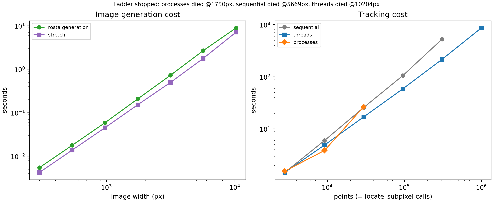

# Timing at Scale

[High Point Density](./high_point_density.md) closed with a question it
didn't answer: how does `dictk`'s tracking time scale as point count
grows? Does that scaling change across sequential, threaded, and
multi-process execution?

[Parallelization](./parallelization.md) already measured the bare
`phase_cross_correlation` primitive. That benchmark ran up to
1,000,000 synthetic calls. But it never ran the real
`dictk.grid.locate_subpixel` pipeline. And it never used an image large
enough to make "many points" physically real, not just a parameter
sweep.

This page runs that pipeline directly. It grows the reference image
until this machine's own limits show up. It reports what actually
stopped the ladder, not what was expected to stop it.

## Test Machine

Every number on this page depends on the hardware it was measured on.
Here is what we used to-date:

* **Apple MacBook Pro (14-inch, 2021), model `MacBookPro18,3`, Apple M1
Pro chip, 10 cores (8 Performance + 2 Efficiency), 32GB RAM, macOS 26.5.2
(Tahoe).**

Same core count as [Parallelization](./parallelization.md)'s own
already-committed benchmark ("measured once on a 10-core machine").

## Points, Elements, and Gauss Points

Every point this page tracks feeds directly into
[`dictk.grid.elements`](../api/dictk/grid.html#elements) and, from
there, into per-element strain via 2×2 Gauss quadrature
([`dictk.element.gauss_points`](../api/dictk/element.html#gauss_points)),
the same machinery [High Point Density](./high_point_density.md) and
[Finite Element Method](./finite_element_method.md) already use.

A regular grid of $x_{\text{count}} \times y_{\text{count}}$ points gives:

$$
z = x_{\text{count}} \cdot y_{\text{count}}
$$

total points. Four points in a cycle make one element, so a grid with
$x_{\text{count}}$ points along $x$ and $y_{\text{count}}$ along $y$
tiles into:

$$
n_{\text{elements}} = (x_{\text{count}} - 1)(y_{\text{count}} - 1)
$$

elements. Each axis has one fewer element than points, because every
interior point is shared by up to four neighboring elements. Each
element carries 4 Gauss points — the standard 2×2 quadrature rule for
a Q4 element. So:

$$
n_{\text{Gauss}} = 4\, n_{\text{elements}} = 4 (x_{\text{count}} - 1)(y_{\text{count}} - 1)
$$

As $x_{\text{count}}, y_{\text{count}} \to \infty$, $n_{\text{elements}}
\to z$. So $n_{\text{Gauss}} \to 4z$. At high density, four Gauss
points exist per *point*, not per element.

This page's own largest successful tier (5669px, 998×998 points)
confirms the asymptote numerically: $z = 996{,}004$ points,
$n_{\text{elements}} = 994{,}009$, $n_{\text{gauss}} = 3{,}976{,}036$.
That ratio is 3.992 — already within 0.2% of the limiting value of 4.

$z$ is also exactly the number of
[`dictk.grid.locate_subpixel`](../api/dictk/grid.html#locate_subpixel)
calls this page's benchmark makes: one correlation per point, not per
element or per Gauss point. That's why point count, not element or
Gauss-point count, is the x-axis variable below.

## Growing the Reference Image

Every prior page in this book built its current image the same way. It
started from [`dictk.image.astronaut`](../api/dictk/image.html#astronaut),
a fixed 512×512 photograph. When a larger canvas was needed, it
upsampled that photograph with bicubic interpolation
(`scipy.ndimage.zoom`). Then it added speckle via
[`dictk.rosta.rosta`](../api/dictk/rosta.html#rosta) and combined the
two with `combine`.

That approach works fine at book scale. But growing the photograph 20x
or 100x linearly risks its own artifacts: softened edges, ringing near
hard boundaries. Once point counts climb into the millions, those
artifacts would be indistinguishable from genuine tracking degradation.

This page drops the photo layer entirely.
[`rosta`](../api/dictk/rosta.html#rosta) generates its speckle pattern
directly, at whatever resolution it's asked for. That speckle is
Gaussian-smoothed thresholded noise. It needs no upsampling step, and
it has no fixed source resolution to run out of.

Real DIC surfaces are speckle-only anyway. The astronaut photograph
elsewhere in this book only helps human readers recognize the
subregion. The speckle pattern carries the correlation; the photograph
does not.

Reference and current images for every tier below are built this way:

```python
reference_image = rosta(width=W, height=W, dot_size=..., smoothness=...)
current_image = stretch(arr=reference_image, factor_x=1.02)
```

This is the same 2% stretch every prior page in this book has used.
Here it's applied directly to the pure speckle field `rosta` produced.

One rescaling kept this affordable.
[`rosta`](../api/dictk/rosta.html#rosta)'s `dot_size` and `smoothness`
parameters set a Gaussian filter's sigma as a fraction of the image,
not a fixed pixel count: `dot_size * min(width, height) / 1000`.

Leaving `dot_size` and `smoothness` fixed while `width` grows causes a
problem. The speckle dots grow too, in real pixel size. `gaussian_filter`'s
own cost grows with sigma. So total generation cost grows cubically
with image width.

A direct measurement confirms this. At 10,000×10,000 pixels,
generation took 34.2s using the 300px-tuned defaults. Rescaling
`dot_size` and `smoothness` by the same factor the image grew cut that
time to 8.2s.

Every tier on this page applies that rescaling. `rosta_params_for` (in
the script below) divides `dot_size` and `smoothness` by the image's
growth factor. This keeps the speckle dot's real pixel size constant.
Generation cost then stays close to linear in image size.

## Finding the Ceiling

[`timing_at_scale_bench.py`](#timing_at_scale_benchpy) (full source
below) runs a geometric ladder of image widths: 300, 540, 972, 1750,
3149, 5669, 10204px — each step ×1.8 larger than the last, starting
from [High Point Density](./high_point_density.md)'s own 300px
baseline. At each size, it times sequential, threaded, and
process-pool execution of `dictk.grid.locate_subpixel` across the
resulting point grid.

Tracking geometry matches [High Point Density](./high_point_density.md)
directly: `kernel_margin=13`, `upsample_factor=100`. `search_margin`
cannot stay fixed the way it did there, though. At a constant
`factor_x=1.02`, maximum displacement grows with the image itself
(`max_x * 0.02`). A fixed margin tuned for a 300px image would
silently undershoot the true displacement at every larger tier. So
each tier computes its own margin from its own maximum displacement
instead.

Each `(width, executor)` combination runs in its own isolated
subprocess, with its own 1800-second (30-minute) wall-clock budget. A controlling
loop launches each one; nothing runs in-process. Deliberately pushing
a laptop toward a resource limit is not something to do inside the
same process that's also tracking the result.

macOS doesn't reliably raise a catchable `MemoryError` the way Linux
does. A runaway allocation can instead thrash the whole machine
through heavy swapping. Or the kernel can SIGKILL the process outright,
with no Python exception to catch. Subprocess isolation contains
either outcome to one measurement. It never takes down the whole run.

This sweep takes hours, not minutes, and is expected to end in a
deliberate failure. Its results were measured once, and committed
alongside the script that produced them:

<!-- cmdrun python3 -c "import csv; rows = list(csv.DictReader(open('timing_at_scale_bench.csv'))); widths = sorted(set(int(r['width']) for r in rows)); z_for = lambda w: (lambda o: ((w - 2*o)//5 + 1)**2)(round(18*w/300)); succ = lambda w, ex: [r for r in rows if int(r['width'])==w and r['stage']==ex]; fail = lambda w, ex: [r for r in rows if int(r['width'])==w and r['stage'].startswith('FAILED') and r['stage'].endswith('_'+ex)]; cell = lambda w, ex: (f\"{float(succ(w,ex)[-1]['seconds']):.1f}s\") if succ(w,ex) else ('timeout (1800s)' if fail(w,ex) and 'timeout' in fail(w,ex)[-1]['stage'] else ('crashed' if fail(w,ex) else '—')); td = lambda v: f'<td style=\"text-align: right;\">{v}</td>'; print('<table>'); print('<thead><tr><th>Width (px)</th><th>Points</th><th>Sequential</th><th>Threads</th><th>Processes</th></tr></thead>'); print('<tbody>'); [print(f\"<tr>{td(w)}{td(f'{z_for(w):,}')}{td(cell(w,'sequential'))}{td(cell(w,'threads'))}{td(cell(w,'processes'))}</tr>\") for w in widths]; print('</tbody>'); print('</table>')" -->

<figure>
    
    <figcaption>Image generation and tracking cost across the full ladder, this machine, measured once. Left: <code>rosta</code> generation and <code>stretch</code> both scale smoothly with image width, confirming the dot-size rescaling above kept generation cost from going cubic. Right: tracking cost vs. point count for all three executors. Every series ends where its own executor died — not at a common point count, and not at a common image size.</figcaption>
</figure>

Threads pull ahead as point count grows, and by a widening margin. At
300px, threads and sequential run a statistical tie (0.999x) — 2,809
points isn't enough yet to amortize thread scheduling overhead. That
margin grows: 1.5x at 972px, 1.8x at 1750px, 2.4x at 3149px.

This matches [Parallelization](./parallelization.md#choosing-an-executor)'s
own "many points, moderate-to-large correlations" regime. That's
exactly where this pipeline sits once point counts climb past a few
thousand.

## Where It Breaks

None of the three executors died to memory pressure. This page checked
`sysctl vm.swapusage` directly, polling it roughly every 30 seconds
throughout the entire multi-hour run, watching for the moment `used`
became nonzero. It never did — not once, at any tier, for any
executor.

Peak resident set size (`ru_maxrss`, sampled after every stage) topped
out at 11.5GB. That peak came from `stretch` alone, at the final
10204px tier — barely a third of this machine's 32GB. Every executor
died for its own reason. None of those reasons was RAM.

**`processes` died first, at 1750px. The cause is a real architectural
bottleneck, not a resource limit.** It's already the slowest of the
three by 972px: 26.5s, versus sequential's own 25.6s. That's worse
than doing nothing extra — a full tier before its final failure.

The cause is visible directly in
[`dictk.grid.locate`](../api/dictk/grid.html#locate)'s own source. It
binds `reference_image`/`current_image` into a `partial` once. Then it
hands that partial to `ProcessPoolExecutor.map()`:

```python
worker = partial(
    _locate_worker,
    reference_image=reference_image,
    current_image=current_image,
    ...
)
with executor_cls(max_workers=max_workers) as pool:
    return list(pool.map(worker, zip(reference_points, search_centers)))
```

`ProcessPoolExecutor.map()` re-pickles that bound callable once per
task, not once per worker. The image arrays get re-pickled too, every
time. At a few hundred points and a 300px image, that cost is trivial.
At tens of thousands of points and a multi-megapixel image, it isn't:
the main process spends more time serializing the same large array
over and over than any worker spends computing.

A retry at 1750px, under this page's own raised 1800-second (30-minute) budget,
confirmed this directly. CPU utilization held around 50% of one core.
That's a process bottlenecked on serialization, not eight processes
computing in parallel. It showed no sign of finishing soon, so this
page stopped it deliberately, once the cause was understood — running
it to exhaustion would only have proven a point already proven.

This is a real, unfixed limitation in `dictk` itself. It's named here
rather than patched, the same precedent [High Point
Density](./high_point_density.md#a-real-trade-off-not-a-bug) set for
its own strain-window-averaging finding.

**`sequential` and `threads` both died to this script's own
1800-second (30-minute) timeout. That's a compute-time wall, not a memory one.**
`sequential` reached 3149px: 308,025 points, 525.1s. Its next tier,
5669px, then ran out the full budget.

`threads` went one tier further. It completed that same 5669px tier
successfully — 996,004 points, 861.5s, with healthy ~6-8x realized
parallelism visible in top-level CPU usage throughout. It then also
ran out the 1800-second (30-minute) budget at the next tier, 10204px (3,229,209
points). Extrapolating past its own last measured scaling trend, that
tier needed roughly an hour of work — about twice the budget.

Both failures were checked directly, not assumed. CPU usage stayed
high, and RSS stayed well under the machine's ceiling, for the entire
lifetime of each failed run. These are legitimate long computations
that simply outran their own budget. None of them hung, leaked, or
crashed.

**The honest finding, stated plainly:** on this machine, with this
pipeline, compute time is the wall this ladder actually hit. Memory
never became a constraint — at least not up to the roughly one
million points this ladder successfully tracked.

[Path Forward](./path_forward.md)'s GPU direction has been gated on "a
documented CPU bottleneck" since it was first written. This page
documents one, with real numbers. A real DIC problem at
finite-element-mesh scale needs at least a billion correlations, per
that same page's own north star. Reaching a million took `threads`
14.4 minutes on 10 cores. A billion points is 1000x that. Extrapolating
`threads`'s own measured rate straight-line to that scale lands at
about 1.4 weeks (≈240 hours) — far past this page's own 30-minute
per-tier budget. No amount of additional CPU-side tuning closes a gap
that size on its own.

### `timing_at_scale_bench.py`

```python
<!-- cmdrun cat timing_at_scale_bench.py -->
```
