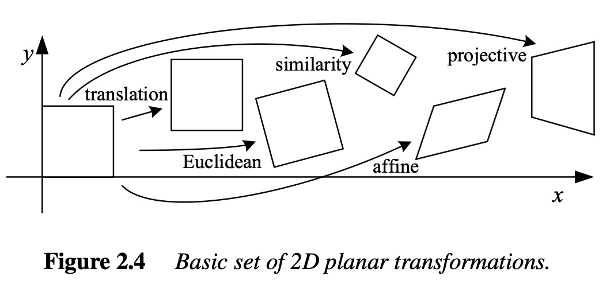

# Image Transformation

Image deformations, also called *transformations* in the computer vision
literature (see Szeliski[^Szeliski_2022]), fall into the categories shown
below:

<figure>
    
    <figcaption>
        Figure: Categories of 2D planar transformations from Szeliski.
    </figcaption>
</figure>

## Pure Translation (Rigid Body Motion)

As the simplest of the categories above — no change in shape or size —
[`dictk.imaging.translate`](../api/dictk/imaging.html#translate) shifts
every pixel by a fixed displacement. This example shifts the image by
dx=-60 pixels in x and dy=+80 pixels in y, representing rigid body
motion where the material moves without deforming.

```python
import dictk
from dictk.imaging import translate, write_image

photo = dictk.astronaut(300, 300)
write_image(photo, "astronaut_translate_original.png")

translated = translate(photo, dx=-60, dy=80)
write_image(translated, "astronaut_translate_rigid_body.png")
```

```text
<!-- cmdrun python3 -c "import dictk; from dictk.imaging import translate, write_image; photo = dictk.astronaut(300, 300); write_image(photo, 'astronaut_translate_original.png'); translated = translate(photo, dx=-60, dy=80); write_image(translated, 'astronaut_translate_rigid_body.png'); print('Saved: astronaut_translate_original.png, astronaut_translate_rigid_body.png')" -->
```

Translation | Image
--- | ---
Original | 
dx=-60, dy=+80 | 

## Pure Rotation

A 30° counterclockwise rotation, another rigid body motion that preserves
distances and angles.
[`dictk.imaging.rotate`](../api/dictk/imaging.html#rotate) pivots on the
image's top-left corner (0, 0), consistent with `stretch` and
`translate`'s pivot choice in this codebase — unlike the more typical
"object spins in place" rotation about the center, most content swings
away from that fixed corner, similar to a door on a hinge.

```python
import dictk
from dictk.imaging import rotate, write_image

photo = dictk.astronaut(300, 300)
write_image(photo, "astronaut_rotate_original.png")

rotated = rotate(photo, 30.0)
write_image(rotated, "astronaut_rotate_30deg.png")
```

```text
<!-- cmdrun python3 -c "import dictk; from dictk.imaging import rotate, write_image; photo = dictk.astronaut(300, 300); write_image(photo, 'astronaut_rotate_original.png'); rotated = rotate(photo, 30.0); write_image(rotated, 'astronaut_rotate_30deg.png'); print('Saved: astronaut_rotate_original.png, astronaut_rotate_30deg.png')" -->
```

Rotation | Image
--- | ---
Original | 
30° (origin-pivoted) | 

## X-Axis Stretch (Extension)

As a concrete example of the *similarity* category above,
[`dictk.imaging.stretch`](../api/dictk/imaging.html#stretch) applies a
uniaxial stretch along the x-axis: the image's top-left corner (x=0, y=0)
stays fixed, and content grows away from it, using backward mapping with
bilinear interpolation so the result has no gaps (unlike naively moving
each source pixel forward, which can leave holes). The two stretches
below range from a small, realistic deformation (5%, similar in magnitude
to a modest tensile strain in a materials test) up to a much larger one
(50%).

```python
import dictk
from dictk.imaging import stretch, write_image

photo = dictk.astronaut(300, 300)
write_image(photo, "astronaut_stretch_original.png")

stretch_5pct = stretch(photo, factor_x=1.05)
write_image(stretch_5pct, "astronaut_stretch_x_5pct.png")

stretch_50pct = stretch(photo, factor_x=1.50)
write_image(stretch_50pct, "astronaut_stretch_x_50pct.png")
```

```text
<!-- cmdrun python3 -c "import dictk; from dictk.imaging import stretch, write_image; photo = dictk.astronaut(300, 300); write_image(photo, 'astronaut_stretch_original.png'); write_image(stretch(photo, factor_x=1.05), 'astronaut_stretch_x_5pct.png'); write_image(stretch(photo, factor_x=1.50), 'astronaut_stretch_x_50pct.png'); print('Saved: astronaut_stretch_original.png, astronaut_stretch_x_5pct.png, astronaut_stretch_x_50pct.png')" -->
```

Stretch | Image
--- | ---
Original | 
5% (factor_x=1.05) | 
50% (factor_x=1.50) | 

## Y-Axis Stretch (Compression)

The same [`dictk.imaging.stretch`](../api/dictk/imaging.html#stretch)
function compresses along the y-axis with `factor_y < 1.0`. Pivoting on
the origin means the top edge (y=0) stays fixed while content shrinks
toward it, leaving a black margin along the bottom — the mirror image of
the x-axis stretch case, where growth away from the origin never leaves a
gap.

```python
import dictk
from dictk.imaging import stretch, write_image

photo = dictk.astronaut(300, 300)
write_image(photo, "astronaut_compress_original.png")

compress_neg5pct = stretch(photo, factor_y=0.95)
write_image(compress_neg5pct, "astronaut_compress_y_neg5pct.png")

compress_neg50pct = stretch(photo, factor_y=0.50)
write_image(compress_neg50pct, "astronaut_compress_y_neg50pct.png")
```

```text
<!-- cmdrun python3 -c "import dictk; from dictk.imaging import stretch, write_image; photo = dictk.astronaut(300, 300); write_image(photo, 'astronaut_compress_original.png'); write_image(stretch(photo, factor_y=0.95), 'astronaut_compress_y_neg5pct.png'); write_image(stretch(photo, factor_y=0.50), 'astronaut_compress_y_neg50pct.png'); print('Saved: astronaut_compress_original.png, astronaut_compress_y_neg5pct.png, astronaut_compress_y_neg50pct.png')" -->
```

Compression | Image
--- | ---
Original | 
-5% (factor_y=0.95) | 
-50% (factor_y=0.50) | 

## Simple Shear

A shear deformation with γ = 0.5, where horizontal planes slide relative
to each other by an amount proportional to their y-coordinate — the
higher up a row of pixels, the further it shifts sideways.
[`dictk.imaging.shear`](../api/dictk/imaging.html#shear) pivots on the
image's top-left corner (0, 0), consistent with the other transform
functions in this codebase.

```python
import dictk
from dictk.imaging import shear, write_image

photo = dictk.astronaut(300, 300)
write_image(photo, "astronaut_shear_original.png")

sheared = shear(photo, shear_x=0.5)
write_image(sheared, "astronaut_shear_x_0.5.png")
```

```text
<!-- cmdrun python3 -c "import dictk; from dictk.imaging import shear, write_image; photo = dictk.astronaut(300, 300); write_image(photo, 'astronaut_shear_original.png'); sheared = shear(photo, shear_x=0.5); write_image(sheared, 'astronaut_shear_x_0.5.png'); print('Saved: astronaut_shear_original.png, astronaut_shear_x_0.5.png')" -->
```

Shear | Image
--- | ---
Original | 
γ = 0.5 (shear_x=0.5) | 

## Complex Deformation

Combines rotation (15°) with anisotropic stretching (1.3x in x, 0.8x in
y) — realistic loading scenarios where materials experience multiple
simultaneous deformation modes, typically the hardest case for
correlation algorithms.
[`dictk.imaging.complex_deform`](../api/dictk/imaging.html#complex_deform)
composes the two into a single deformation gradient (stretch applied
first, then rotation) and applies it in one backward-mapping pass, so
the result isn't blurred by interpolating twice as calling `stretch`
and then `rotate` separately would.

```python
import dictk
from dictk.imaging import complex_deform, write_image

photo = dictk.astronaut(300, 300)
write_image(photo, "astronaut_complex_original.png")

combined = complex_deform(photo, factor_x=1.3, factor_y=0.8, angle=15.0)
write_image(combined, "astronaut_complex_deform.png")
```

```text
<!-- cmdrun python3 -c "import dictk; from dictk.imaging import complex_deform, write_image; photo = dictk.astronaut(300, 300); write_image(photo, 'astronaut_complex_original.png'); combined = complex_deform(photo, factor_x=1.3, factor_y=0.8, angle=15.0); write_image(combined, 'astronaut_complex_deform.png'); print('Saved: astronaut_complex_original.png, astronaut_complex_deform.png')" -->
```

Composed Deformation | Image
--- | ---
Original | 
factor_x=1.3, factor_y=0.8, angle=15° | 

## Crack Dislocation

A vertical crack splits the image at x = width/2: the left half shifts
down 8 pixels and the right half shifts up 8 pixels, producing a
displacement field that jumps discontinuously across the crack line —
unlike every other example on this page, which deforms smoothly.
Standard DIC assumes smooth displacements and cannot capture this jump;
cases like this motivate the Heaviside finite-element formulation.

This is where a speckle pattern earns its keep: on a plain photograph,
an 8-pixel jump is subtle, but overlaid with
[`dictk.rosta`](../api/dictk.html#rosta) it's immediately visible as a
misaligned speckle field across the crack.

```python
import dictk
from dictk.imaging import combine_images, crack_dislocation, write_image

photo = dictk.astronaut(300, 300)
speckle = dictk.rosta(300, 300, density=0.5)
reference = combine_images(speckle, photo)
write_image(reference, "astronaut_crack_original.png")

cracked = crack_dislocation(reference, offset=8.0)
write_image(cracked, "astronaut_crack_dislocation.png")
```

```text
<!-- cmdrun python3 -c "import dictk; from dictk.imaging import combine_images, crack_dislocation, write_image; photo = dictk.astronaut(300, 300); speckle = dictk.rosta(300, 300, density=0.5); reference = combine_images(speckle, photo); write_image(reference, 'astronaut_crack_original.png'); cracked = crack_dislocation(reference, offset=8.0); write_image(cracked, 'astronaut_crack_dislocation.png'); print('Saved: astronaut_crack_original.png, astronaut_crack_dislocation.png')" -->
```

Crack Dislocation | Image
--- | ---
Original (speckle + astronaut) | 
offset=8 pixels | 

## References

[^Szeliski_2022]: Szeliski R. Computer vision: algorithms and applications, 2nd Edition, Springer Nature; 2022 Jan 3. [download](https://1drv.ms/b/c/3cc1bee5e2795295/IQBSP0s8pYRBRJArjzAAx3PbAcZ0PUh149lv7Z85uiBp-ms?e=FUynzc) (43 MB)
